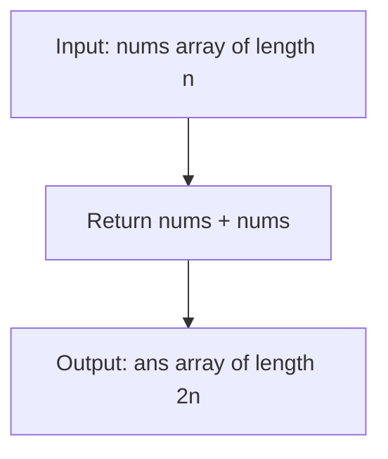

# LC 1929 - Concatenation of Array

## Problem

Given an integer array `nums` of length `n`, you want to create an array `ans` of length `2n` where:

- `ans[i] == nums[i]` for `0 <= i < n`
- `ans[i + n] == nums[i]` for `0 <= i < n`

Specifically, `ans` is the **concatenation** of two `nums` arrays.

Return the array `ans`.

---

## Examples

### Example 1

```
Input:  nums = [1, 2, 1]
Output: [1, 2, 1, 1, 2, 1]
```

**Explanation:**
```
ans = [nums[0], nums[1], nums[2], nums[0], nums[1], nums[2]]
ans = [1, 2, 1, 1, 2, 1]
```

---

### Example 2

```
Input:  nums = [1, 3, 2, 1]
Output: [1, 3, 2, 1, 1, 3, 2, 1]
```

---

## Approach: Direct Concatenation

### Key Insight

The problem literally asks us to concatenate the array with itself. In Python, this is a one-liner using the `+` operator.

### Algorithm

Simply return `nums + nums`. Python's list concatenation creates a new list containing all elements from the first `nums` followed by all elements from the second `nums`.

```python
class Solution:
    def getConcatenation(self, nums: list[int]) -> list[int]:
        return nums + nums
```

---

## Complexity Analysis

| | Time | Space |
|--|------|-------|
| **getConcatenation** | **O(n)** — copy all elements twice | **O(n)** — output array of size 2n |

---

## Flowchart



---

## Example Test Case Trace

**Input:** `nums = [1, 2, 1]`

### Step-by-step

| Step | Action | Result |
|------|--------|--------|
| 1 | Take first copy of nums | `[1, 2, 1]` |
| 2 | Concatenate second copy | `[1, 2, 1] + [1, 2, 1]` |
| 3 | Final result | `[1, 2, 1, 1, 2, 1]` |

---

## Run Tests

```bash
PYTHONPATH=/workspaces/Data-Structure-and-Algorithm- python Array/LC_1929/test.py
```
