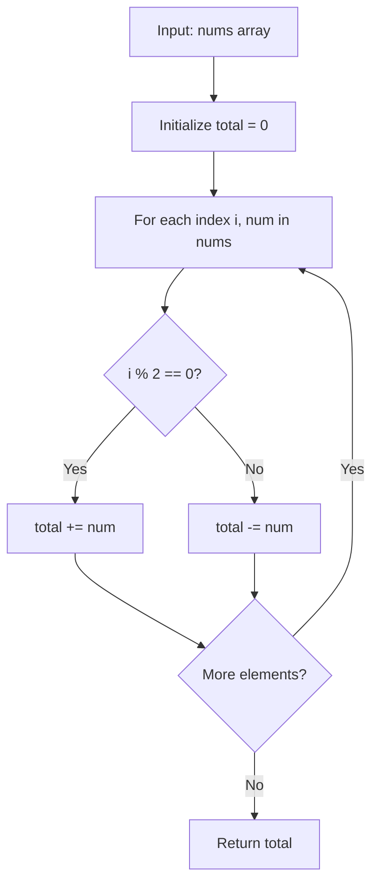

# LC 3701 - Compute Alternating Sum

## Problem

You are given an integer array `nums`.

The **alternating sum** of `nums` is the value obtained by **adding** elements at even indices and **subtracting** elements at odd indices. That is:

```
nums[0] - nums[1] + nums[2] - nums[3]...
```

Return an integer denoting the alternating sum of `nums`.

---

## Examples

### Example 1

```
Input:  nums = [1, 3, 5, 7]
Output: -4
```

**Explanation:**
- Elements at even indices: `nums[0] = 1`, `nums[2] = 5`
- Elements at odd indices: `nums[1] = 3`, `nums[3] = 7`
- Alternating sum: `1 - 3 + 5 - 7 = -4`

---

### Example 2

```
Input:  nums = [100]
Output: 100
```

**Explanation:**
- Only element at even index: `nums[0] = 100`
- Alternating sum: `100`

---

## Approach: Single Pass Simulation

### Key Insight

The alternating sum is simply:
- **Add** elements at even indices (`i % 2 == 0`)
- **Subtract** elements at odd indices (`i % 2 == 1`)

We can compute this in a single pass through the array.

### Algorithm

1. Initialize `total = 0`
2. For each index `i` and value `num` in `nums`:
   - If `i` is even: `total += num`
   - If `i` is odd: `total -= num`
3. Return `total`

```python
class Solution:
    def alternatingSum(self, nums: list[int]) -> int:
        total = 0
        for i, num in enumerate(nums):
            if i % 2 == 0:
                total += num
            else:
                total -= num
        return total
```

---

## Complexity Analysis

| | Time | Space |
|--|------|-------|
| **alternatingSum** | **O(n)** — one pass through the array | **O(1)** — only a counter variable |

---

## Flowchart



---

## Example Test Case Trace

**Input:** `nums = [1, 3, 5, 7]`

| Index i | num | i % 2 | Operation | total |
|---------|-----|-------|-----------|-------|
| 0 | 1 | 0 (even) | total += 1 | 1 |
| 1 | 3 | 1 (odd) | total -= 3 | -2 |
| 2 | 5 | 0 (even) | total += 5 | 3 |
| 3 | 7 | 1 (odd) | total -= 7 | -4 |

**Result:** `-4`

---

## Run Tests

```bash
PYTHONPATH=/workspaces/Data-Structure-and-Algorithm- python Array/LC_3701/test.py
```
