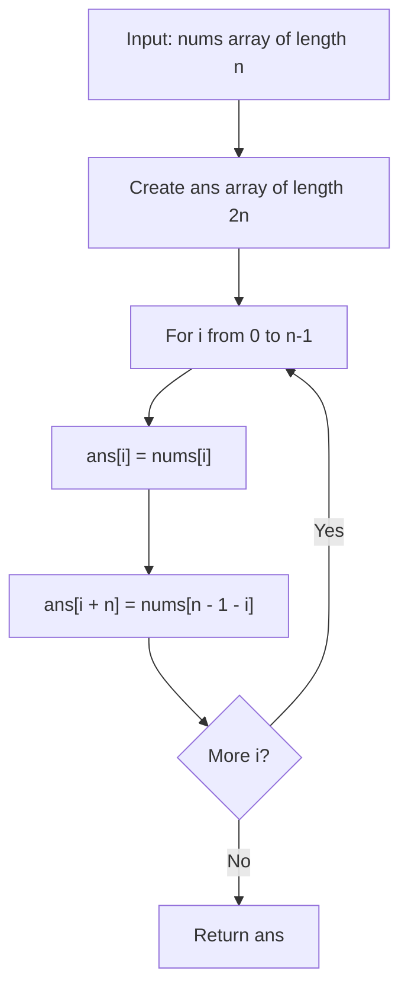

# LC 3925 - Concatenate Array With Reverse

## Problem

You are given an integer array `nums` of length `n`.

Construct a new array `ans` of length `2 * n` such that:

- The first `n` elements are the same as `nums`
- The next `n` elements are the elements of `nums` in reverse order

Formally, for `0 <= i < n`:

```
ans[i] = nums[i]
ans[i + n] = nums[n - 1 - i]
```

Return the array `ans`.

---

## Examples

### Example 1

```
Input:  nums = [1, 2, 3]
Output: [1, 2, 3, 3, 2, 1]
```

---

### Example 2

```
Input:  nums = [1, 2, 3, 4]
Output: [1, 2, 3, 4, 4, 3, 2, 1]
```

---

### Example 3

```
Input:  nums = [1]
Output: [1, 1]
```

---

## Approach: Direct Array Construction

### Key Insight

We need to build a new array of length `2n` where:

- First half: `nums[0], nums[1], ..., nums[n-1]`
- Second half: `nums[n-1], nums[n-2], ..., nums[0]`

This can be done in a single pass by placing elements at their correct positions.

### Algorithm

1. Create result array `ans` of length `2 * n`
2. For each index `i` from `0` to `n-1`:
   - `ans[i] = nums[i]` (forward copy)
   - `ans[i + n] = nums[n - 1 - i]` (reverse copy)
3. Return `ans`

```python
class Solution:
    def concatenateArray(self, nums: list[int]) -> list[int]:
        n = len(nums)
        ans = [0] * (2 * n)

        for i in range(n):
            ans[i] = nums[i]
            ans[i + n] = nums[n - 1 - i]

        return ans
```

---

## Complexity Analysis

|                            | Time           | Space                           |
| -------------------------- | -------------- | ------------------------------- |
| **concatenateArray** | **O(n)** | **O(n)** for output array |

---

## Flowchart



---

## Example Test Case Trace

**Input:** `nums = [1, 2, 3]`

### Step-by-step execution

| i | ans[i] = nums[i] | ans[i+n] = nums[n-1-i] | ans after          |
| - | ---------------- | ---------------------- | ------------------ |
| 0 | ans[0] = 1       | ans[3] = nums[2] = 3   | [1, 0, 0, 3]       |
| 1 | ans[1] = 2       | ans[4] = nums[1] = 2   | [1, 2, 0, 3, 2]    |
| 2 | ans[2] = 3       | ans[5] = nums[0] = 1   | [1, 2, 3, 3, 2, 1] |

### Final result

```
ans = [1, 2, 3, 3, 2, 1]
```

---

## Run Tests

```bash
PYTHONPATH=/workspaces/Data-Structure-and-Algorithm- python Array/LC_3925/test.py
```
