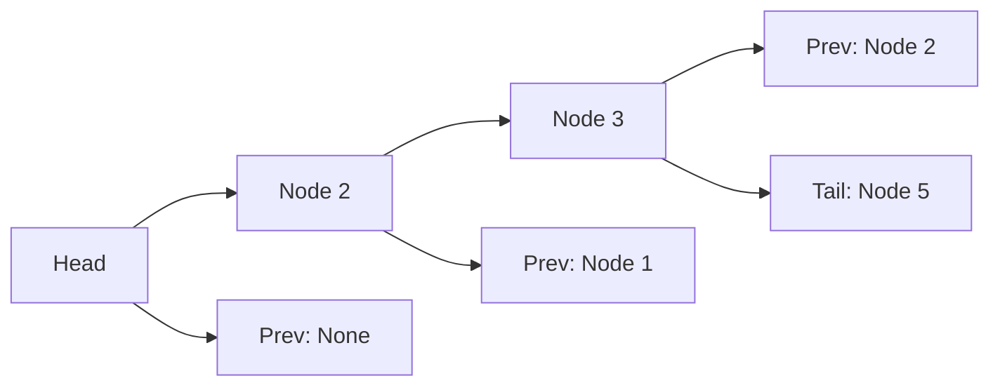

# Doubly Linked List

## Theory

A Doubly Linked List is a linear data structure where each node contains:
- **data** - the value stored in the node
- **prev** - a reference to the previous node
- **next** - a reference to the next node

Unlike a singly linked list, a doubly linked list allows traversal in **both directions** (forward and backward), at the cost of extra memory for the `prev` pointer.

### Node Structure

```
+--------+--------+--------+
|  prev  | data   |  next  |
+--------+--------+--------+
   ^                 ^
   |                 |
 Previous Node    Next Node
```

### Visual Representation



### Pseudocode: Insert Before

```
function insert_before(new_node, existing_node):
    if new_node is in list:
        remove(new_node)
    
    new_node.next = existing_node
    new_node.prev = existing_node.prev
    existing_node.prev = new_node
    
    if new_node.prev is not None:
        new_node.prev.next = new_node
    else:
        head = new_node
```

## Implementation

- **Node class**: stores data, prev, and next pointers
- **DoublyLinkedList class**: manages head/tail pointers and operations
- **remove_node()**: O(1) removal of a given node
- **insert_before()**: O(1) insertion, handles both new and existing nodes

## Usage

```python
from doubly_linked_list import DoublyLinkedList, Node

dll = DoublyLinkedList()
dll.append(1)
dll.append(2)
dll.append(3)

# Remove a node
dll.remove_node(dll.head.next)  # removes node with data=2

# Insert before a node
new_node = Node(99)
dll.insert_before(new_node, dll.head)  # inserts 99 before 1
```

## Interview Questions

### Q1. What is the main difference between a singly linked list and a doubly linked list?

**Answer**: In a singly linked list, each node only has a reference to the **next** node, allowing one-way traversal. In a doubly linked list, each node has both **prev** and **next** references, enabling traversal in both directions.

---

### Q2. What is the time complexity of inserting or deleting a node in a doubly linked list if you already have the node reference?

**Answer**: O(1). Since you have the reference to the node to be inserted or deleted, you can directly update the `prev` and `next` pointers of adjacent nodes without iterating through the list.

---

### Q3. What is the space complexity of a doubly linked list compared to a singly linked list?

**Answer**: A doubly linked list uses **O(n)** extra space compared to a singly linked list because each node stores an additional `prev` pointer. For n nodes, this is n extra references.

---

### Q4. Why is the `prev` pointer of the head node always `None`?

**Answer**: The `head` is the first node in the list and has no node before it, so its `prev` pointer is `None`.

---

### Q5. Why is the `next` pointer of the tail node always `None`?

**Answer**: The `tail` is the last node in the list and has no node after it, so its `next` pointer is `None`.

---

### Q6. Can a doubly linked list be traversed backwards? If yes, how?

**Answer**: Yes. Starting from the `tail` node, repeatedly follow the `prev` pointer until you reach `None`.

```python
current = self.tail
while current:
    print(current.data)
    current = current.prev
```

---

### Q7. When would you choose a doubly linked list over a singly linked list?

**Answer**: When you need bidirectional traversal (e.g., browser history back/forward navigation, undo/redo functionality) or when you frequently need to traverse from the end of the list to the beginning.

---

### Q8. What happens if you try to remove a node that is not part of the list?

**Answer**: The `remove_node` method checks for edge cases and updates adjacent pointers. If the node has no `prev` or `next`, it simply disconnects it from the list. The list remains structurally valid.

---

### Q9. How do you detect if a doubly linked list has a loop?

**Answer**: Use a visited set or modify the node structure with a `visited` flag. Alternatively, since each node has both directions, you can use Floyd's cycle detection algorithm (tortoise and hare) as with singly linked lists.

---

### Q10. What is the advantage of the `remove_node` method taking a node reference instead of a value?

**Answer**: If you already have the reference to the node, removal is O(1). If you only had the value, you'd need O(n) time to first find the node. This is useful when you're iterating and need to delete nodes (e.g., the standard list deletion pattern in LeetCode problems).

---

## File Structure

```
Doubly_Linked_List/
├── doubly_linked_list.py   # Implementation
├── test_dl.py              # Test cases
└── README.md               # Documentation
```
