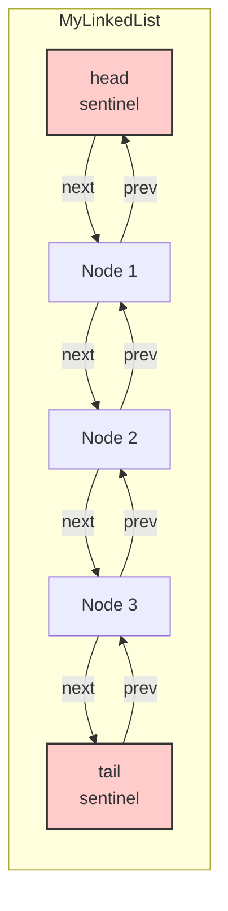

# LC 707 - Design Linked List

## Problem Statement

Design your implementation of the linked list. You can choose to use a singly linked list or a doubly linked list. A node in a singly linked list should have two attributes: `val` and `next`. And a node in a doubly linked list should have three attributes: `val`, `prev`, and `next`.

Implement the `MyLinkedList` class:

- `MyLinkedList()` Initializes the `MyLinkedList` object.
- `int get(int index)` Get the value of the `index`th node in the linked list. If the index is invalid, return `-1`.
- `void addAtHead(int val)` Add a node of value `val` before the first element of the linked list. After the insertion, the new node will be the first node of the linked list.
- `void addAtTail(int val)` Append a node of value `val` as the last element of the linked list.
- `void addAtIndex(int index, int val)` Add a node of value `val` before the `index`th node in the linked list. If `index` equals the length of the linked list, the node will be appended to the end. If `index` is greater than the length, the node will not be inserted. If `index` is less than `0`, the node will be inserted at the head.
- `void deleteAtIndex(int index)` Delete the `index`th node in the linked list, if the index is valid.

## Approach

This implementation uses a **doubly linked list** with two sentinel (dummy) nodes: `head` (left sentinel) and `tail` (right sentinel). This design eliminates the need for null checks when inserting or deleting at the boundaries.

### Key Design Decisions

1. **Sentinel Nodes**: `head` and `tail` act as boundary markers. The actual data starts at `head.next` and ends at `tail.prev`.
2. **Optimized `get()`**: Traverses from the closer end (head or tail) based on the index position, reducing traversal steps roughly by half on average.
3. **Unified Insertion**: The private `_insert(prev_node, val)` method handles all insertions by inserting a new node *after* the given node.

## Code Explanation

### `ListNode`

A simple node class holding `val`, `prev`, and `next`.

```python
class ListNode:
    def __init__(self, val=0, prev=None, next=None):
        self.val = val
        self.prev = prev
        self.next = next
```

### `MyLinkedList`

- **`__init__`**: Creates `head` and `tail` sentinels and links them together. `size` tracks the number of real elements.

- **`get(index)`**:
  - Returns `-1` for invalid indices.
  - If `index` is in the first half, traverses forward from `head.next`.
  - Otherwise, traverses backward from `tail.prev`.

- **`addAtHead(val)`**: Inserts a new node right after `head`.

- **`addAtTail(val)`**: Inserts a new node right after `tail.prev` (i.e., at the end).

- **`addAtIndex(index, val)`**:
  - Silently returns if `index > size`.
  - Inserts at head if `index <= 0`.
  - Otherwise, finds the node at `index - 1` and inserts after it.

- **`deleteAtIndex(index)`**:
  - Silently returns for invalid indices.
  - Bypasses the target node by linking its neighbors together, then decrements `size`.

- **`_insert(prev_node, val)`** (private):
  - Creates a new node between `prev_node` and `prev_node.next`.
  - Updates both forward and backward pointers.
  - Increments `size`.

- **`_getNode(index)`** (private):
  - Traverses forward from `head.next` to return the node at `index`.

## Linked List Structure (Mermaid)



## Test Explanation

The test script exercises all public methods and edge cases:

| Operation | Expected State |
|-----------|----------------|
| Initial `get(0)` on empty list | `-1` |
| `addAtHead(1)` then `addAtHead(2)` | List: `[2, 1]` |
| `get(0)` | `2` |
| `get(1)` | `1` |
| `addAtTail(3)` | List: `[2, 1, 3]` |
| `get(2)` | `3` |
| `addAtIndex(1, 99)` | List: `[2, 99, 1, 3]` |
| `get(1)` | `99` |
| `get(2)` | `1` |
| `deleteAtIndex(1)` | List: `[2, 1, 3]` |
| `get(0)`, `get(1)`, `get(2)` | `2`, `1`, `3` |
| `get(5)` on size-3 list | `-1` |
| `addAtIndex(10, 50)` (invalid) | No change |
| `deleteAtIndex(10)` (invalid) | No change |
| `addAtIndex(0, 0)` | List: `[0, 2, 1, 3]` |
| `get(0)` | `0` |
| `get(1)` | `2` |

## Complexity Analysis

| Operation | Time | Space |
|-----------|------|-------|
| `get` | O(min(index, n - index)) | O(1) |
| `addAtHead` | O(1) | O(1) |
| `addAtTail` | O(1) | O(1) |
| `addAtIndex` | O(index) | O(1) |
| `deleteAtIndex` | O(index) | O(1) |

- `n` is the current size of the linked list.

## Files

- `code.py` - Implementation of `MyLinkedList` and `ListNode`.
- `test.py` - Manual test script demonstrating all operations.
