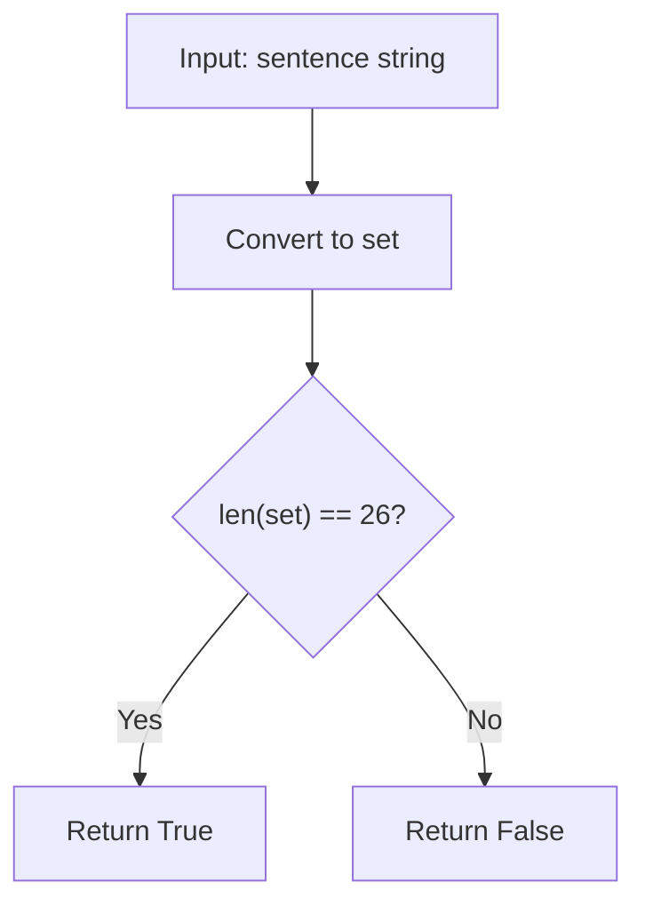

# LC 1832 - Check if the Sentence Is Pangram

## Problem

A **pangram** is a sentence where every letter of the English alphabet appears at least once.

Given a string `sentence` containing only lowercase English letters, return `true` if `sentence` is a pangram, or `false` otherwise.

---

## Examples

### Example 1

```
Input:  sentence = "thequickbrownfoxjumpsoverthelazydog"
Output: true
```

**Explanation:** The sentence contains all 26 letters of the English alphabet.

---

### Example 2

```
Input:  sentence = "leetcode"
Output: false
```

**Explanation:** The sentence does not contain all 26 letters.

---

## Approach: Hash Set

### Key Insight

A pangram must contain **all 26 lowercase English letters** at least once. By converting the sentence to a `set`, we automatically remove duplicates. If the resulting set has exactly 26 unique characters, the sentence is a pangram.

### Algorithm

1. Convert `sentence` to a `set` — this keeps only unique characters
2. Check if `len(set) == 26`
3. Return the result

```python
class Solution:
    def checkIfPangram(self, sentence: str) -> bool:
        return len(set(sentence)) == 26
```

---

## Complexity Analysis

|                          | Time                                       | Space                                                 |
| ------------------------ | ------------------------------------------ | ----------------------------------------------------- |
| **checkIfPangram** | **O(n)** — traverse the string once | **O(1)** — at most 26 unique lowercase letters |

---

## Flowchart



---

## Example Test Case Trace

**Input:** `sentence = "thequickbrownfoxjumpsoverthelazydog"`

### Step 1: Convert to set

```
set(sentence) = {'t','h','e','q','u','i','c','k','b','r','o','w','n','f','o','x','j','m','p','s','v','l','a','z','y','d','g'}
```

### Step 2: Count unique characters

```
Unique characters = 26
```

### Step 3: Result

```
len(set) == 26 → Return True
```

---

## Run Tests

```bash
PYTHONPATH=/workspaces/Data-Structure-and-Algorithm- python Hash_Map/LC_1832/test.py
```
