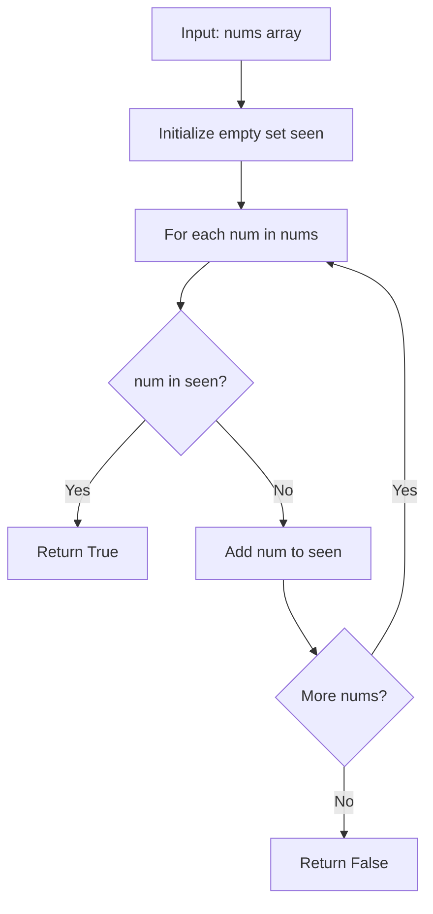

# LC 217 - Contains Duplicate

## Problem

Given an integer array `nums`, return `true` if any value appears **at least twice** in the array, and return `false` if every element is distinct.

---

## Examples

### Example 1

```
Input:  nums = [1, 2, 3, 1]
Output: true
```

**Explanation:** The element `1` appears twice.

---

### Example 2

```
Input:  nums = [1, 2, 3, 4]
Output: false
```

**Explanation:** All elements are distinct.

---

### Example 3

```
Input:  nums = [1, 1, 1, 3, 3, 4, 3, 2, 4, 2]
Output: true
```

---

## Approach: Hash Set

### Key Insight

We need to detect if any element has been seen before. A **hash set** gives us O(1) membership checks and O(1) insertions.

As we iterate through the array:
- If the current number is already in the set → **duplicate found**, return `True`
- Otherwise, add it to the set and continue
- If we finish the loop with no duplicates → return `False`

### Algorithm

1. Initialize an empty set `seen`
2. For each `num` in `nums`:
   - If `num in seen` → return `True`
   - Else → `seen.add(num)`
3. Return `False`

```python
class Solution:
    def containsDuplicate(self, nums: list[int]) -> bool:
        seen = set()
        for num in nums:
            if num in seen:
                return True
            seen.add(num)
        return False
```

---

## Complexity Analysis

| | Time | Space |
|--|------|-------|
| **containsDuplicate** | **O(n)** — single pass through array | **O(n)** — hash set stores at most n elements |

---

## Flowchart



---

## Example Test Case Trace

**Input:** `nums = [1, 2, 3, 1]`

| Step | num | seen before | num in seen? | Action | seen after |
|------|-----|-------------|--------------|--------|------------|
| 1 | 1 | `{}` | No | Add 1 | `{1}` |
| 2 | 2 | `{1}` | No | Add 2 | `{1, 2}` |
| 3 | 3 | `{1, 2}` | No | Add 3 | `{1, 2, 3}` |
| 4 | 1 | `{1, 2, 3}` | **Yes** | Return **True** | — |

---

## Run Tests

```bash
PYTHONPATH=/workspaces/Data-Structure-and-Algorithm- python Hash_Map/LC_217/test.py
```
