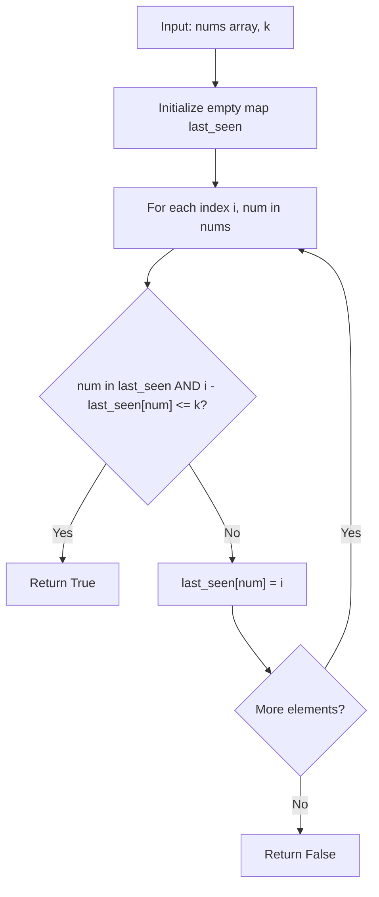

# LC 219 - Contains Duplicate II

## Problem

Given an integer array `nums` and an integer `k`, return `true` if there are two **distinct** indices `i` and `j` such that:

- `nums[i] == nums[j]`
- `abs(i - j) <= k`

Return `false` if no such indices exist.

---

## Examples

### Example 1

```
Input:  nums = [1, 2, 3, 1], k = 3
Output: true
```

**Explanation:** The duplicate `1`s are at indices `0` and `3`. `abs(0 - 3) = 3 <= k`.

---

### Example 2

```
Input:  nums = [1, 0, 1, 1], k = 1
Output: true
```

**Explanation:** The duplicate `1`s are at indices `2` and `3`. `abs(2 - 3) = 1 <= k`.

---

### Example 3

```
Input:  nums = [1, 2, 3, 1, 2, 3], k = 2
Output: false
```

**Explanation:** All duplicates are more than `k` indices apart.

---

## Approach: Hash Map (Last Seen Index)

### Key Insight

We need to check if the **same value** appears twice within a **window of size `k`**. A hash map is perfect for this because we can store the **last seen index** of each value and check the distance on each encounter.

### Algorithm

1. Initialize an empty hash map `last_seen` (value → last index)
2. Iterate through `nums` with index `i`:
   - If `num` is in `last_seen` and `i - last_seen[num] <= k` → return `True`
   - Update `last_seen[num] = i` (store the most recent index)
3. Return `False` if no qualifying pair is found

```python
class Solution:
    def containsNearbyDuplicate(self, nums: list[int], k: int) -> bool:
        last_seen = {}
        for i, num in enumerate(nums):
            if num in last_seen and i - last_seen[num] <= k:
                return True
            last_seen[num] = i
        return False
```

---

## Complexity Analysis

|                                   | Time                          | Space                                                          |
| --------------------------------- | ----------------------------- | -------------------------------------------------------------- |
| **containsNearbyDuplicate** | **O(n)** — single pass | **O(min(n, k))** — map stores at most min(n, k) entries |

The space is bounded by `k` because once an index is more than `k` away from the current position, it can never form a valid pair again. However, in the worst case we may store up to `n` entries.

---

## Flowchart



---

## Example Test Case Trace

**Input:** `nums = [1, 2, 3, 1]`, `k = 3`

| Step | i | num | last_seen before       | i - last_seen[num] | <= k?         | Action               | last_seen after        |
| ---- | - | --- | ---------------------- | ------------------ | ------------- | -------------------- | ---------------------- |
| 1    | 0 | 1   | `{}`                 | —                 | —            | Add 1                | `{1: 0}`             |
| 2    | 1 | 2   | `{1: 0}`             | —                 | —            | Add 2                | `{1: 0, 2: 1}`       |
| 3    | 2 | 3   | `{1: 0, 2: 1}`       | —                 | —            | Add 3                | `{1: 0, 2: 1, 3: 2}` |
| 4    | 3 | 1   | `{1: 0, 2: 1, 3: 2}` | 3 - 0 = 3          | **Yes** | Return**True** | —                     |

---

## Run Tests

```bash
PYTHONPATH=/workspaces/Data-Structure-and-Algorithm- python Hash_Table/LC_219/test.py
```
