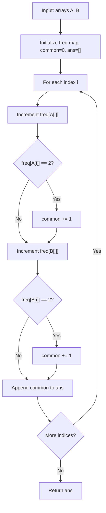

# LC 2657 - Find the Prefix Common Array of Two Arrays

## Problem

You are given two **permutations** `A` and `B`, both containing integers from `1` to `n` exactly once. These are 0-indexed arrays of length `n`.

Your task is to find the **prefix common array** `C` for these two permutations.

For each position `i` in the result array `C`:

- `C[i]` represents the count of numbers that appear in **both** `A[0...i]` and `B[0...i]`
- In other words, `C[i]` counts how many distinct numbers are present in both arrays up to and including index `i`

---

## Examples

### Example 1

```
Input:  A = [1, 3, 2, 4], B = [3, 1, 2, 4]
Output: [0, 2, 3, 4]
```

**Explanation:**

- At index 0: `A[0]=1`, `B[0]=3`. No common numbers → `C[0]=0`
- At index 1: `A[0..1]=[1,3]`, `B[0..1]=[3,1]`. Common: `{1,3}` → `C[1]=2`
- At index 2: `A[0..2]=[1,3,2]`, `B[0..2]=[3,1,2]`. Common: `{1,2,3}` → `C[2]=3`
- At index 3: `A[0..3]=[1,3,2,4]`, `B[0..3]=[3,1,2,4]`. Common: `{1,2,3,4}` → `C[3]=4`

---

### Example 2

```
Input:  A = [1, 2, 3, 4], B = [2, 3, 4, 1]
Output: [0, 1, 3, 4]
```

---

## Approach: Hash Map (Frequency Counter)

### Key Insight

Since `A` and `B` are permutations, each number from `1` to `n` appears **exactly once** in each array. A number becomes "common" at index `i` if it has appeared in **both** arrays up to that point.

We can track this with a frequency hash map:

- `freq[x] = 1` → seen in only one array so far
- `freq[x] = 2` → seen in **both** arrays → contributes to `common` count

### Algorithm

1. Initialize empty hash map `freq`, `common = 0`, and result list `ans`
2. For each index `i`:
   - Increment `freq[A[i]]`. If it becomes `2`, increment `common`
   - Increment `freq[B[i]]`. If it becomes `2`, increment `common`
   - Append `common` to `ans`
3. Return `ans`

```python
class Solution:
    def findPrefixCommonArray(self, A: list[int], B: list[int]) -> list[int]:
        freq = {}
        common = 0
        ans = []

        for i in range(len(A)):
            freq[A[i]] = freq.get(A[i], 0) + 1
            if freq[A[i]] == 2:
                common += 1

            freq[B[i]] = freq.get(B[i], 0) + 1
            if freq[B[i]] == 2:
                common += 1

            ans.append(common)

        return ans
```

---

## Complexity Analysis

|                                 | Time                          | Space                                                |
| ------------------------------- | ----------------------------- | ---------------------------------------------------- |
| **findPrefixCommonArray** | **O(n)** — single pass | **O(n)** — hash map stores at most n elements |

---

## Flowchart



---

## Example Test Case Trace

**Input:** `A = [1, 3, 2, 4]`, `B = [3, 1, 2, 4]`

| i | A[i] | freq[A[i]] | common? | B[i] | freq[B[i]] | common? | C[i] |
| - | ---- | ---------- | ------- | ---- | ---------- | ------- | ---- |
| 0 | 1    | 1          | No      | 3    | 1          | No      | 0    |
| 1 | 3    | 1          | No      | 1    | 2          | Yes     | 2    |
| 2 | 2    | 1          | No      | 2    | 2          | Yes     | 3    |
| 3 | 4    | 1          | No      | 4    | 2          | Yes     | 4    |

**Result:** `[0, 2, 3, 4]`

---

## Run Tests

```bash
PYTHONPATH=/workspaces/Data-Structure-and-Algorithm- python Hash_Map/LC_2657/test.py
```
