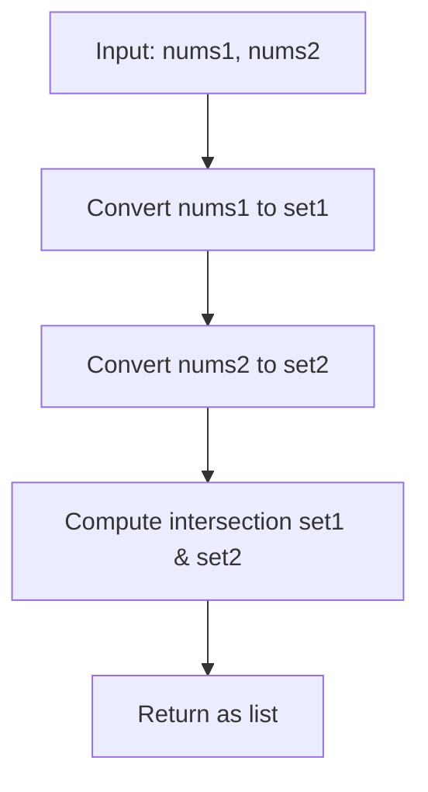

# LC 349 - Intersection of Two Arrays

## Problem

Given two integer arrays `nums1` and `nums2`, return an array of their **unique** intersection. Each element in the result must be unique and you may return the result in **any order**.

---

## Examples

### Example 1

```
Input:  nums1 = [1, 2, 2, 1], nums2 = [2, 2]
Output: [2]
```

---

### Example 2

```
Input:  nums1 = [4, 9, 5], nums2 = [9, 4, 9, 8, 4]
Output: [9, 4]
```

---

## Approach: Hash Set Intersection

### Key Insight

Since we only need **unique** elements that appear in both arrays, we can convert both arrays to sets and compute their intersection.

### Algorithm

1. Convert `nums1` to a set
2. Convert `nums2` to a set
3. Return the intersection as a list

```python
class Solution:
    def intersection(self, nums1: list[int], nums2: list[int]) -> list[int]:
        set1 = set(nums1)
        set2 = set(nums2)
        return list(set1 & set2)
```

---

## Complexity Analysis

| | Time | Space |
|--|------|-------|
| **intersection** | **O(n + m)** — build both sets | **O(n + m)** — both sets |

---

## Flowchart



---

## Example Test Case Trace

**Input:** `nums1 = [1, 2, 2, 1]`, `nums2 = [2, 2]`

| Step | Action | Result |
|------|--------|--------|
| 1 | `set(nums1)` | `{1, 2}` |
| 2 | `set(nums2)` | `{2}` |
| 3 | `{1, 2} & {2}` | `{2}` |
| 4 | `list(...)` | `[2]` |

---

## Run Tests

```bash
PYTHONPATH=/workspaces/Data-Structure-and-Algorithm- python Hash_Map/LC_349/test.py
```
