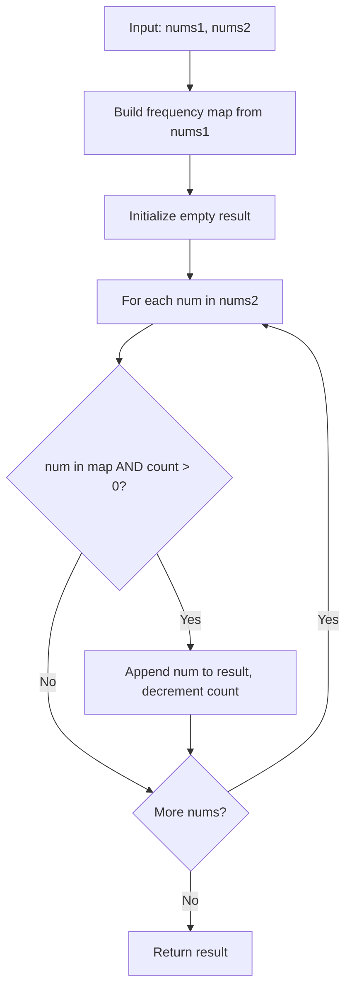

# LC 350 - Intersection of Two Arrays II

## Problem

Given two integer arrays `nums1` and `nums2`, return an array of their **intersection** with duplicates included. Each element in the result should appear as many times as it shows in **both** arrays. You may return the result in **any order**.

---

## Examples

### Example 1

```
Input:  nums1 = [1, 2, 2, 1], nums2 = [2, 2]
Output: [2, 2]
```

---

### Example 2

```
Input:  nums1 = [4, 9, 5], nums2 = [9, 4, 9, 8, 4]
Output: [4, 9]
```

**Note:** The result `[4, 9]` is correct because `4` appears once in `nums1` and twice in `nums2`, so it can only appear once in the result.

---

## Approach: Hash Map (Frequency Counter)

### Key Insight

Unlike LC 349, this problem requires us to respect **duplicate counts**. If `nums1` has two `2`s and `nums2` has one `2`, the result should contain only one `2`.

We use a hash map to store the frequency of each element in `nums1`, then scan `nums2` and collect elements that still have positive counts.

### Algorithm

1. Build a frequency hash map from `nums1`
2. Scan `nums2`:
   - If `num` is in the map and count > 0, add it to result and decrement count
3. Return result

```python
class Solution:
    def intersect(self, nums1: list[int], nums2: list[int]) -> list[int]:
        count = {}
        for num in nums1:
            count[num] = count.get(num, 0) + 1

        result = []
        for num in nums2:
            if num in count and count[num] > 0:
                result.append(num)
                count[num] -= 1

        return result
```

---

## Complexity Analysis

| | Time | Space |
|--|------|-------|
| **intersect** | **O(n + m)** — two passes | **O(n)** — hash map stores nums1 frequencies |

---

## Flowchart



---

## Example Test Case Trace

**Input:** `nums1 = [1, 2, 2, 1]`, `nums2 = [2, 2]`

### Step 1: Build frequency map from `nums1`

| Element | Count |
|---------|-------|
| 1 | 2 |
| 2 | 2 |

### Step 2: Scan `nums2` and collect

| num | in map? | count | Action | result | count after |
|-----|---------|-------|--------|--------|-------------|
| 2 | Yes | 2 | Append, decrement | `[2]` | 2: 1 |
| 2 | Yes | 1 | Append, decrement | `[2, 2]` | 2: 0 |

### Step 3: Result

```
result = [2, 2]
```

---

## Run Tests

```bash
PYTHONPATH=/workspaces/Data-Structure-and-Algorithm- python Hash_Map/LC_350/test.py
```
