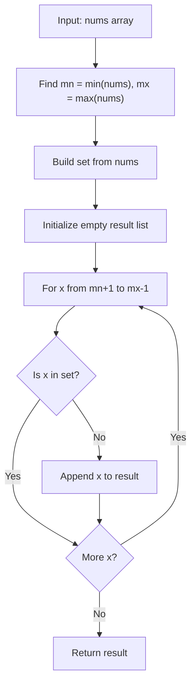

# LC 3731 - Find Missing Elements

## Problem

You are given an integer array `nums` consisting of **unique** integers.

Originally, `nums` contained **every integer** within a certain range. However, some integers might have gone **missing** from the array.

The **smallest** and **largest** integers of the original range are still present in `nums`.

Return a **sorted** list of all the missing integers in this range. If no integers are missing, return an **empty** list.

---

## Examples

### Example 1

```
Input:  nums = [1, 4, 2, 5]
Output: [3]
```

**Explanation:**

- Smallest integer: `1`
- Largest integer: `5`
- Full range should be: `[1, 2, 3, 4, 5]`
- Missing integer: `3`

---

### Example 2

```
Input:  nums = [7, 8, 6, 9]
Output: []
```

**Explanation:**

- Smallest integer: `6`
- Largest integer: `9`
- Full range: `[6, 7, 8, 9]`
- All integers are present, so nothing is missing

---

### Example 3

```
Input:  nums = [5, 1]
Output: [2, 3, 4]
```

**Explanation:**

- Smallest integer: `1`
- Largest integer: `5`
- Full range: `[1, 2, 3, 4, 5]`
- Missing integers: `2, 3, 4`

---

## Approach: Hash Set + Range Scan

### Key Insight

Since we need to check whether each integer in a range exists in the array, a **hash set** gives us O(1) membership checks.

The smallest and largest values define the bounds of the original range. We just need to scan every integer between them and collect the ones that are not present.

### Algorithm

1. Find `mn = min(nums)` and `mx = max(nums)`
2. Build a `set` from `nums` for O(1) lookups
3. Iterate `x` from `mn + 1` to `mx - 1` (inclusive)
4. If `x` is not in the set, append it to the result
5. Return the result (already sorted because we iterate in ascending order)

```python
class Solution:
    def findMissingElements(self, nums: list[int]) -> list[int]:
        lookup = set(nums)
        mn = min(nums)
        mx = max(nums)
        result = []

        for x in range(mn + 1, mx):
            if x not in lookup:
                result.append(x)

        return result
```

---

## Complexity Analysis

|                               | Time                                                         | Space                                    |
| ----------------------------- | ------------------------------------------------------------ | ---------------------------------------- |
| **findMissingElements** | **O(n + r)** — O(n) to build set + O(r) to scan range | **O(n)** — hash set + result list |

Where `n = len(nums)` and `r = mx - mn` (size of the range)

---

## Flowchart



---

## Example Test Case Trace

**Input:** `nums = [1, 4, 2, 5]`

### Step 1: Find bounds and build set

```
mn = 1
mx = 5
lookup = {1, 2, 4, 5}
```

### Step 2: Scan range [2, 4]

| x | x in lookup? | Action   |
| - | ------------ | -------- |
| 2 | Yes          | Skip     |
| 3 | No           | Append 3 |
| 4 | Yes          | Skip     |

### Step 3: Result

```
result = [3]
```

---

## Run Tests

```bash
PYTHONPATH=/workspaces/Data-Structure-and-Algorithm- python Hash_Map/LC_3731/test.py
```
