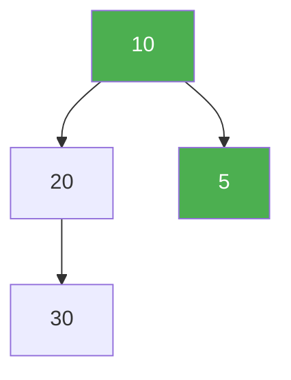
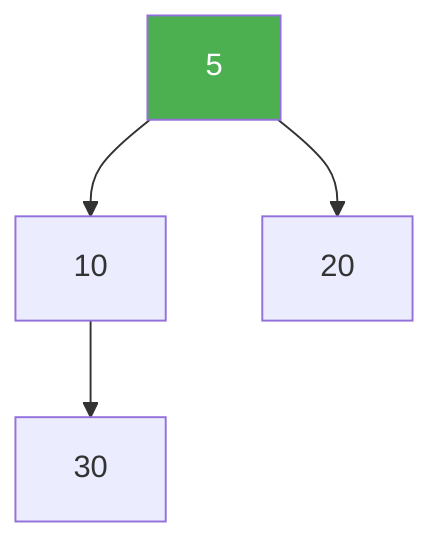
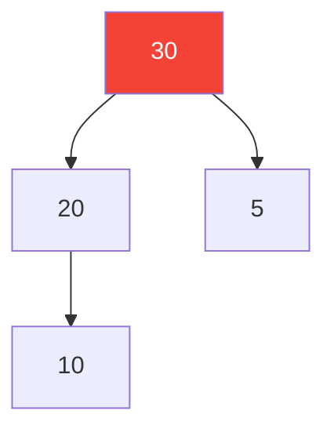
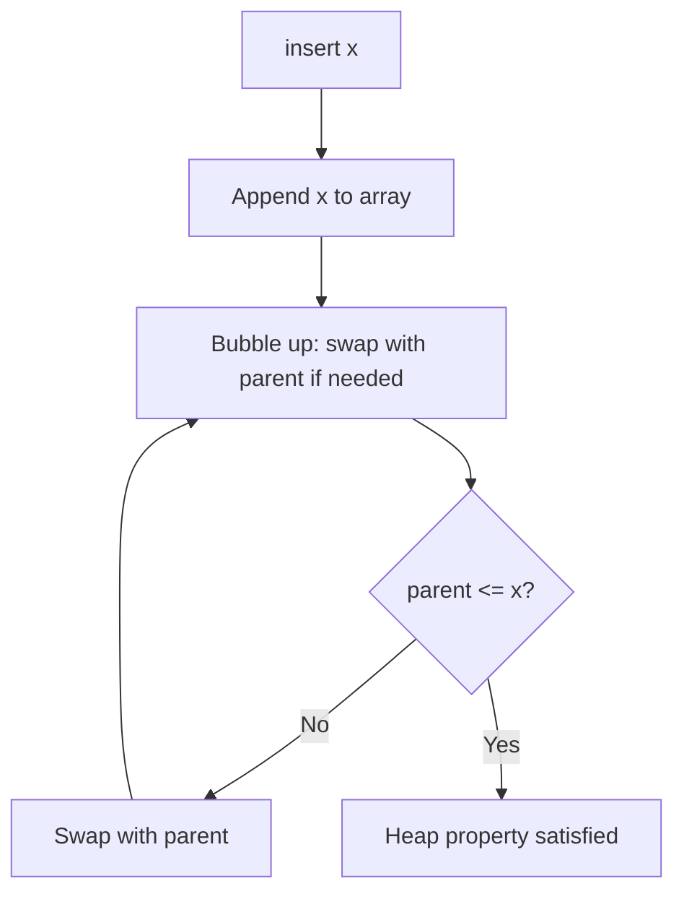
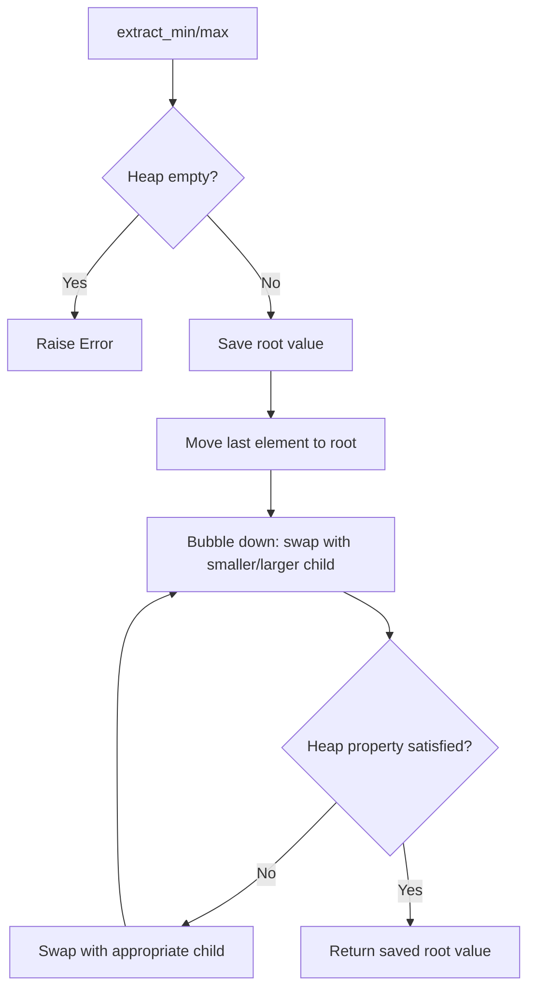

# Heap

## Theory

A **Heap** is a specialized **complete binary tree** that satisfies the **heap property**. It is commonly implemented as an **array** because of its complete binary tree structure.

### Key Properties

1. **Complete Binary Tree** — all levels are fully filled except possibly the last, which is filled from left to right.
2. **Heap Property**:
   - **MinHeap**: `parent <= children` (smallest at root)
   - **MaxHeap**: `parent >= children` (largest at root)

### Why Array-Based?

Because a heap is a complete binary tree, we can store it in an array with no gaps:

```
For node at index i:
  - Parent index = (i - 1) // 2
  - Left child  = 2 * i + 1
  - Right child = 2 * i + 2
```

---

## Visual Representation

### MinHeap

Inserting `[10, 20, 5, 30]` step by step:



After heapify (bubble up 5):



Array representation: `[5, 10, 20, 30]`

### MaxHeap

Inserting `[10, 20, 5, 30]`:



Array representation: `[30, 20, 5, 10]`

---

## Operations

| Operation | MinHeap | MaxHeap | Description |
| --------- | ------- | ------- | ----------- |
| `insert(x)` | O(log n) | O(log n) | Add element and bubble up |
| `extract_min/max()` | O(log n) | O(log n) | Remove root and bubble down |
| `peek()` | O(1) | O(1) | Return root without removing |
| `is_empty()` | O(1) | O(1) | Check if heap has no elements |
| `size()` | O(1) | O(1) | Return number of elements |

### Insert Flow



### Extract Min/Max Flow



---

## Implementation

### MinHeap

```python
class MinHeap:
    def __init__(self):
        self.heap = []

    def insert(self, value):
        self.heap.append(value)
        self._bubble_up(len(self.heap) - 1)

    def extract_min(self):
        if self.is_empty():
            raise IndexError("Heap is Empty")
        if len(self.heap) == 1:
            return self.heap.pop()
        min_val = self.heap[0]
        self.heap[0] = self.heap.pop()
        self._bubble_down(0)
        return min_val

    def peek(self):
        if self.is_empty():
            raise IndexError("Heap is Empty")
        return self.heap[0]

    def is_empty(self):
        return len(self.heap) == 0

    def size(self):
        return len(self.heap)

    def _bubble_up(self, index):
        while index > 0:
            parent = (index - 1) // 2
            if self.heap[index] < self.heap[parent]:
                self.heap[index], self.heap[parent] = self.heap[parent], self.heap[index]
                index = parent
            else:
                break

    def _bubble_down(self, index):
        while True:
            left = 2 * index + 1
            right = 2 * index + 2
            smallest = index

            if left < len(self.heap) and self.heap[left] < self.heap[smallest]:
                smallest = left
            if right < len(self.heap) and self.heap[right] < self.heap[smallest]:
                smallest = right

            if smallest != index:
                self.heap[index], self.heap[smallest] = self.heap[smallest], self.heap[index]
                index = smallest
            else:
                break
```

### MaxHeap

```python
class MaxHeap:
    def __init__(self):
        self.heap = []

    def insert(self, value):
        self.heap.append(value)
        self._bubble_up(len(self.heap) - 1)

    def extract_max(self):
        if self.is_empty():
            raise IndexError("Heap is Empty")
        if len(self.heap) == 1:
            return self.heap.pop()
        max_val = self.heap[0]
        self.heap[0] = self.heap.pop()
        self._bubble_down(0)
        return max_val

    def peek(self):
        if self.is_empty():
            raise IndexError("Heap is Empty")
        return self.heap[0]

    def is_empty(self):
        return len(self.heap) == 0

    def size(self):
        return len(self.heap)

    def _bubble_up(self, index):
        while index > 0:
            parent = (index - 1) // 2
            if self.heap[index] > self.heap[parent]:
                self.heap[index], self.heap[parent] = self.heap[parent], self.heap[index]
                index = parent
            else:
                break

    def _bubble_down(self, index):
        while True:
            left = 2 * index + 1
            right = 2 * index + 2
            largest = index

            if left < len(self.heap) and self.heap[left] > self.heap[largest]:
                largest = left
            if right < len(self.heap) and self.heap[right] > self.heap[largest]:
                largest = right

            if largest != index:
                self.heap[index], self.heap[largest] = self.heap[largest], self.heap[index]
                index = largest
            else:
                break
```

---

## Usage

```python
from basics import MinHeap, MaxHeap

# MinHeap Example
mh = MinHeap()
mh.insert(10)
mh.insert(20)
mh.insert(5)
print(mh.peek())       # 5
print(mh.extract_min()) # 5
print(mh.extract_min()) # 10

# MaxHeap Example
mx = MaxHeap()
mx.insert(10)
mx.insert(20)
mx.insert(5)
print(mx.peek())       # 20
print(mx.extract_max()) # 20
print(mx.extract_max()) # 10
```

---

## Complexity Analysis

| Operation | Time Complexity | Space Complexity |
| --------- | --------------- | ---------------- |
| Build Heap | O(n) | O(1) extra |
| Insert | O(log n) | O(1) |
| Extract Min/Max | O(log n) | O(1) |
| Peek | O(1) | O(1) |
| Search | O(n) | O(1) |

---

## Common Use Cases

1. **Priority Queues** — task scheduling, Dijkstra's algorithm
2. **Heap Sort** — O(n log n) in-place sorting
3. **Kth Largest/Smallest Element** — maintain a heap of size k
4. **Median Maintenance** — two heaps (min + max) approach
5. **Event Loop / Job Queue** — always process the highest priority job

---

## Interview Questions

### Q1. Why is a heap called a "complete binary tree"?

**Answer**: Because all levels except possibly the last are completely filled, and the last level has nodes as far left as possible. This property allows us to store the heap in a contiguous array without wasted space.

---

### Q2. What is the time complexity of building a heap from an array?

**Answer**: **O(n)**. Although inserting n elements one by one takes O(n log n), building a heap from an existing array using heapify (bottom-up approach) takes O(n).

---

### Q3. What is the main difference between a MinHeap and a MaxHeap?

**Answer**: In a MinHeap, the root is the **minimum** element and every parent is smaller than or equal to its children. In a MaxHeap, the root is the **maximum** element and every parent is larger than or equal to its children.

---

### Q4. Can we search for an arbitrary element in a heap efficiently?

**Answer**: No. Heap does not maintain sorted order for all elements, only the root is guaranteed to be min/max. Searching takes **O(n)** time in the worst case.

---

### Q5. Why is heap sort not stable?

**Answer**: Because the relative order of equal elements may change during the heapify and extraction process. The heap structure does not preserve the original insertion order of equal values.

---

### Q6. What is the space complexity of a heap?

**Answer**: **O(n)** to store n elements, with **O(1)** extra auxiliary space for operations.

---

## File Structure

```
Heaps/
└── Basics/
    ├── basics.py    # MinHeap and MaxHeap implementation
    ├── test.py      # Unit tests
    └── README.md    # Documentation
```
