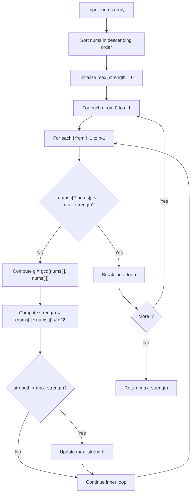

# LC 4010 - Maximize Pair Strength Using GCD

## Problem

You are given an integer array `nums`.

The **pair strength** of two elements `nums[i]` and `nums[j]` is defined as:

```
(nums[i] * nums[j]) / gcd(nums[i], nums[j])^2
```

Return the maximum possible pair strength among all possible pairs `(i, j)` where `0 <= i < j < n`.

---

## Examples

### Example 1

```
Input:  nums = [1, 2, 3]
Output: 6
```

**Explanation:**

- `gcd(1, 2) = 1`, strength = `(1 * 2) / 1^2 = 2`
- `gcd(1, 3) = 1`, strength = `(1 * 3) / 1^2 = 3`
- `gcd(2, 3) = 1`, strength = `(2 * 3) / 1^2 = 6`

Maximum strength = **6**

---

### Example 2

```
Input:  nums = [2, 4, 8]
Output: 4
```

**Explanation:**

- `gcd(2, 4) = 2`, strength = `(2 * 4) / 2^2 = 8 / 4 = 2`
- `gcd(2, 8) = 2`, strength = `(2 * 8) / 2^2 = 16 / 4 = 4`
- `gcd(4, 8) = 4`, strength = `(4 * 8) / 4^2 = 32 / 16 = 2`

Maximum strength = **4**

---

### Example 3

```
Input:  nums = [560, 3]
Output: 1680
```

**Explanation:**

- `gcd(560, 3) = 1`, strength = `(560 * 3) / 1^2 = 1680`

---

## Approach: Brute Force with Optimization

### Key Insight

The pair strength formula:

```
strength = (a * b) / gcd(a, b)^2
```

Since `gcd(a, b) >= 1`, we know that `strength <= a * b`. This gives us an important optimization: if we sort the array in descending order, and the current best strength is `max_strength`, then any pair where `a * b <= max_strength` can be skipped because it cannot produce a better result.

### Algorithm

1. Sort `nums` in descending order
2. For each pair `(i, j)` with `i < j`:
   - If `nums[i] * nums[j] <= max_strength`, break the inner loop (no better result possible)
   - Compute `g = gcd(nums[i], nums[j])`
   - Compute `strength = (nums[i] * nums[j]) // (g * g)`
   - Update `max_strength` if needed
3. Return `max_strength`

```python
from math import gcd

class Solution:
    def maxPairStrength(self, nums: list[int]) -> int:
        nums.sort(reverse=True)
        n = len(nums)
        max_strength = 0

        for i in range(n):
            for j in range(i + 1, n):
                if nums[i] * nums[j] <= max_strength:
                    break
                g = gcd(nums[i], nums[j])
                strength = (nums[i] * nums[j]) // (g * g)
                if strength > max_strength:
                    max_strength = strength

        return max_strength
```

---

## Complexity Analysis

|                           | Time                                                   | Space                                      |
| ------------------------- | ------------------------------------------------------ | ------------------------------------------ |
| **maxPairStrength** | **O(n^2)** worst case, often faster with pruning | **O(1)** extra (sorting is in-place) |

The early break optimization can significantly reduce the number of pairs checked in practice, especially when large-strength pairs are found early.

---

## Flowchart



---

## Example Test Case Trace

**Input:** `nums = [2, 4, 8]`

### Step 1: Sort descending

```
nums = [8, 4, 2]
```

### Step 2: Check all pairs

| Pair   | a | b | gcd | a*b | g^2 | strength           |
| ------ | - | - | --- | --- | --- | ------------------ |
| (8, 4) | 8 | 4 | 4   | 32  | 16  | 32/16 =**2** |
| (8, 2) | 8 | 2 | 2   | 16  | 4   | 16/4 =**4**  |
| (4, 2) | 4 | 2 | 2   | 8   | 4   | 8/4 =**2**   |

### Step 3: Result

```
max_strength = 4
```

---

## Run Tests

```bash
PYTHONPATH=/workspaces/Data-Structure-and-Algorithm- python Math/LC_4010/test.py
```
