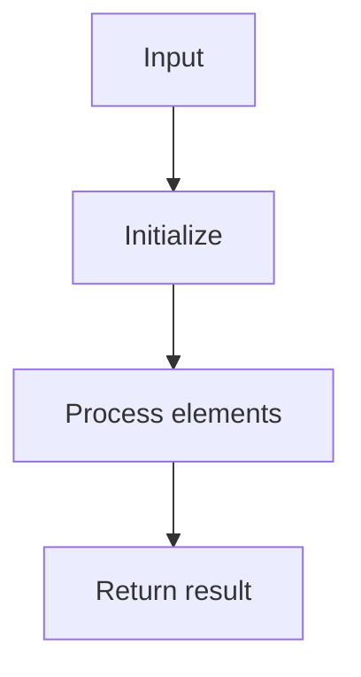

# LC 69 Sqrt(x)

## Problem

Compute floor(sqrt(x)).

## Approach

Use math.sqrt and floor.

## Complexity

O(1) time, O(1) space.


```mermaid
flowchart TD
    A["Input"] --> B["Initialize"]
    B --> D["Process elements"]
    D --> G["Return result"]
```

## Run Tests

```bash
python -m Math.LC_69.test
```
