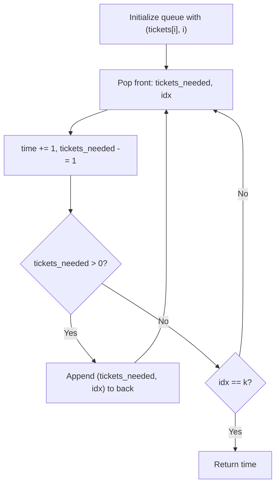

# LC 2073 - Time Needed to Buy Tickets

## Problem

There are `n` people in a queue, and each person wants to buy a certain number of tickets.

You are given an array `tickets` where `tickets[i]` is the number of tickets the `i-th` person wants to buy.

People buy tickets one at a time, in the order of the queue:

- The person at the front of the queue buys **one ticket** (takes 1 second)
- If they still need more tickets, they go to the **back** of the queue
- If they are done buying tickets, they leave the queue

Return the **time (in seconds)** it takes for the person at position `k` to finish buying all their tickets.

---

## Examples

### Example 1

```
Input:  tickets = [2, 3, 2], k = 2
Output: 6
```

**Process:**

```
t=1: [2,3,2] → pop person 0 (needs 2, gets 1) → [3,2,1]
t=2: [3,2,1] → pop person 1 (needs 3, gets 1) → [2,1,2]
t=3: [2,1,2] → pop person 2 (needs 2, gets 1) → [1,2,1]  ← person 2 (k) still waiting
t=4: [1,2,1] → pop person 0 (needs 1, gets 1) → [2,1]     ← person 0 done
t=5: [2,1]   → pop person 1 (needs 2, gets 1) → [1,2]
t=6: [1,2]   → pop person 2 (needs 1, gets 1) → done!     ← person 2 (k) done at t=6
```

---

### Example 2

```
Input:  tickets = [5, 1, 1, 1], k = 0
Output: 8
```

Person 0 needs 5 tickets and is at the front. They buy one per round:

- Round 1: t=1, person 0 buys 1 (4 left) → goes back
- Round 2: t=2, person 0 buys 1 (3 left) → goes back
- Round 3: t=3, person 0 buys 1 (2 left) → goes back
- Round 4: t=4, person 0 buys 1 (1 left) → goes back
- Round 5: t=5, person 0 buys 1 (0 left) → done!

But others also buy tickets in between. The total time for person 0 (k=0) to finish is **8 seconds**.

---

## Approach: Queue Simulation

### Algorithm

1. Create a queue of tuples: `(tickets_needed, index)`
2. While the queue is not empty:
   - Pop the front person
   - Decrement their tickets by 1
   - Increment time counter
   - If they still need tickets → append them back
   - If they are done **and** their index is `k` → return time

```python
from collections import deque

class Solution:
    def timeRequiredToBuy(self, tickets: list[int], k: int) -> int:
        queue = deque([(tickets[i], i) for i in range(len(tickets))])
        time = 0

        while queue:
            tickets_needed, idx = queue.popleft()
            tickets_needed -= 1
            time += 1

            if tickets_needed > 0:
                queue.append((tickets_needed, idx))
            elif idx == k:
                return time
```

---

## Complexity Analysis

|                             | Time                                                                    | Space                                             |
| --------------------------- | ----------------------------------------------------------------------- | ------------------------------------------------- |
| **timeRequiredToBuy** | **O(sum(tickets))** — each ticket purchase is one loop iteration | **O(n)** — queue stores at most n elements |

---

## Flowchartccccxper



---

## Example Test Case Trace

**Input:** `tickets = [2, 3, 2]`, `k = 2`

| Time | Queue (tickets, index)                         | Action                              |
| ---- | ---------------------------------------------- | ----------------------------------- |
| 1    | `(2,0), (3,1), (2,2)` → pop (2,0) → 1 left | Append (1,0)                        |
| 2    | `(3,1), (2,2), (1,0)` → pop (3,1) → 2 left | Append (2,1)                        |
| 3    | `(2,2), (1,0), (2,1)` → pop (2,2) → 1 left | Append (1,2)                        |
| 4    | `(1,0), (2,1), (1,2)` → pop (1,0) → 0 left | Done, not k                         |
| 5    | `(2,1), (1,2)` → pop (2,1) → 1 left        | Append (1,1)                        |
| 6    | `(1,2), (1,1)` → pop (1,2) → 0 left        | **Done, idx=2=k → return 6** |

---

## Run Tests

```bash
PYTHONPATH=/workspaces/Data-Structure-and-Algorithm- python Queue/LC_2073/test.py
```
