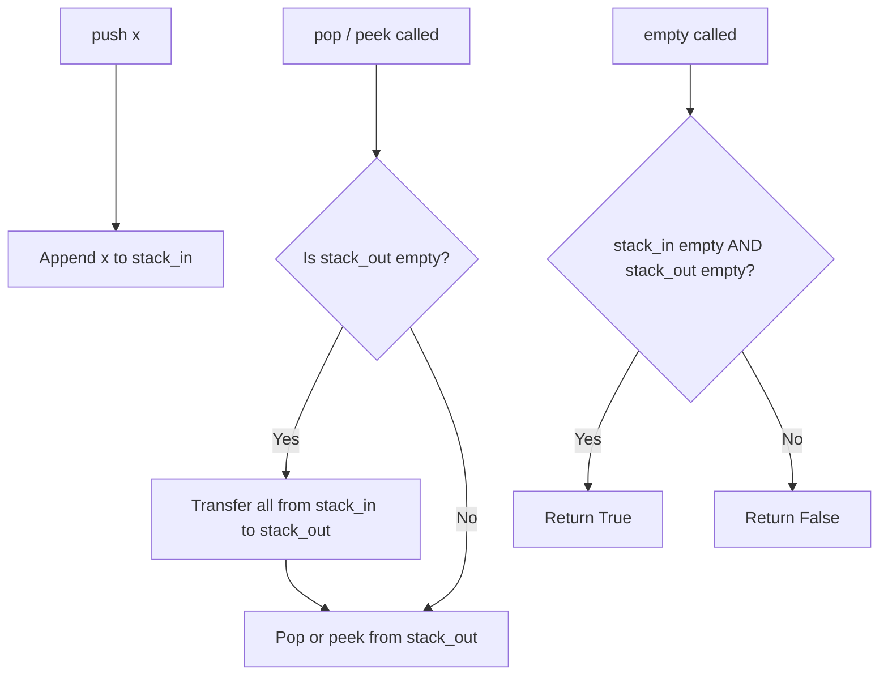

# LC 232 - Implement Queue using Stacks

## Problem

Implement a first in first out (FIFO) queue using only two stacks. The implemented queue should support all the functions of a normal queue (`push`, `pop`, `peek`, and `empty`).

**Implement the `MyQueue` class:**

- `void push(int x)` — Push element `x` to the back of the queue
- `int pop()` — Removes the element from the front of the queue and returns it
- `int peek()` — Returns the element at the front of the queue
- `boolean empty()` — Returns `true` if the queue is empty, `false` otherwise

**Note:** You must use only standard operations of a stack: `push to top`, `peek/pop from top`, `size`, and `is empty` operations.

---

## Examples

### Example 1

```
Input:
["MyQueue", "push", "push", "peek", "pop", "empty"]
[[], [1], [2], [], [], []]

Output:
[null, null, null, 1, 1, false]
```

**Explanation:**
```
MyQueue myQueue = new MyQueue();
myQueue.push(1);          // queue: [1]
myQueue.push(2);          // queue: [1, 2]
myQueue.peek();           // return 1
myQueue.pop();            // return 1, queue: [2]
myQueue.empty();          // return false
```

---

## Approach: Two Stacks (Lazy Transfer)

### Key Insight

A stack is **LIFO** (Last In, First Out), but a queue is **FIFO** (First In, First Out). To get FIFO behavior from two stacks, we use the **transfer trick**:

1. **stack_in**: receives all `push` operations
2. **stack_out**: serves `pop` and `peek` operations

When `stack_out` is empty, we transfer all elements from `stack_in` to `stack_out`. This reverses the order, so the oldest element ends up on top of `stack_out`.

```
stack_in = [1, 2, 3]  →  transfer  →  stack_out = [3, 2, 1]
                                                  ↑ top (oldest = 1)
```

### Algorithm

- `push(x)`: append to `stack_in` — O(1)
- `pop()`: if `stack_out` is empty, transfer all from `stack_in` to `stack_out`, then pop from `stack_out` — O(1) amortized
- `peek()`: same as `pop()` but return `stack_out[-1]` without removing
- `empty()`: both stacks must be empty

```python
class MyQueue:

    def __init__(self):
        self.stack_in = []
        self.stack_out = []

    def _transfer(self):
        if not self.stack_out:
            while self.stack_in:
                self.stack_out.append(self.stack_in.pop())

    def push(self, x: int) -> None:
        self.stack_in.append(x)

    def pop(self) -> int:
        self._transfer()
        return self.stack_out.pop()

    def peek(self) -> int:
        self._transfer()
        return self.stack_out[-1]

    def empty(self) -> bool:
        return not self.stack_in and not self.stack_out
```

---

## Complexity Analysis

| Operation | Time | Space |
|-----------|------|-------|
| `push(x)` | **O(1)** | O(1) |
| `pop()` | **O(1) amortized** — each element is transferred at most once | O(1) |
| `peek()` | **O(1) amortized** | O(1) |
| `empty()` | **O(1)** | O(1) |

**Overall space:** O(n) — both stacks together store all n elements

---

## Flowchart



---

## Example Test Case Trace

**Operations:** `push(1)`, `push(2)`, `peek()`, `pop()`, `empty()`

| Operation | stack_in | stack_out | Action |
|-----------|----------|-----------|--------|
| `push(1)` | `[1]` | `[]` | Add to stack_in |
| `push(2)` | `[1, 2]` | `[]` | Add to stack_in |
| `peek()` | `[]` | `[2, 1]` | Transfer + peek → returns 1 |
| `pop()` | `[]` | `[2]` | Pop from stack_out → returns 1 |
| `empty()` | `[]` | `[2]` | Not empty → returns False |

---

## Run Tests

```bash
PYTHONPATH=/workspaces/Data-Structure-and-Algorithm- python Queue/LC_232/test.py
```
