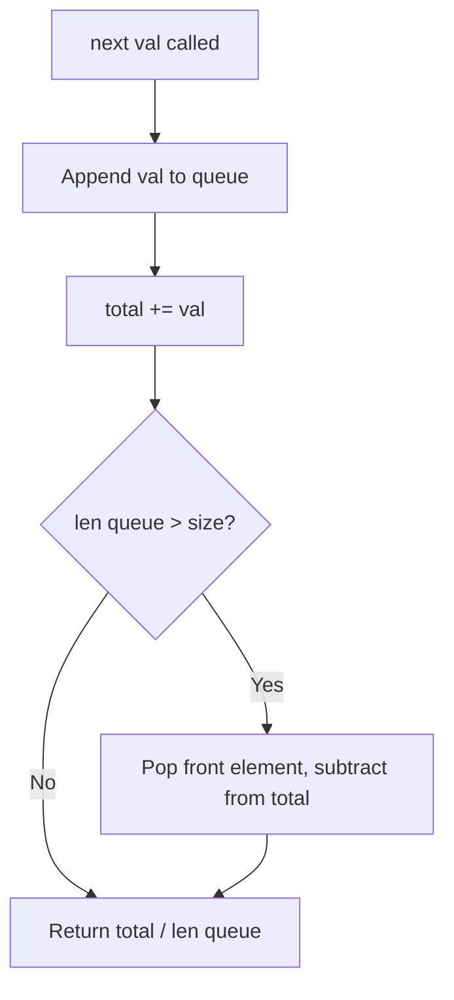

# LC 346 - Moving Average from Data Stream

## Problem

Given a stream of integers and a window size `size`, calculate the moving average of all integers in the sliding window.

Implement the `MovingAverage` class:

- `MovingAverage(int size)` — Initializes the object with the size of the window `size`
- `double next(int val)` — Returns the moving average of the last `size` values of the stream

---

## Examples

### Example 1

```
Input:
["MovingAverage", "next", "next", "next", "next"]
[[3], [1], [10], [3], [5]]

Output:
[null, 1.0, 5.5, 4.66667, 6.0]
```

**Explanation:**
```
MovingAverage movingAverage = new MovingAverage(3);
movingAverage.next(1);    // return 1.0 = 1 / 1
movingAverage.next(10);   // return 5.5 = (1 + 10) / 2
movingAverage.next(3);    // return 4.66667 = (1 + 10 + 3) / 3
movingAverage.next(5);    // return 6.0 = (10 + 3 + 5) / 3
```

---

## Approach: Sliding Window with Queue + Running Sum

### Key Insight

We need to maintain a window of the last `size` elements. A queue is perfect for this because:
1. New elements are added at the **back** (`append`)
2. When the window exceeds `size`, the **oldest** element is removed from the **front** (`popleft`)
3. We maintain a `total` variable so the average calculation is O(1)

### Algorithm

1. Initialize a queue and `total = 0`
2. On `next(val)`:
   - Append `val` to the queue
   - Add `val` to `total`
   - If queue length exceeds `size`, remove the front element and subtract it from `total`
   - Return `total / len(queue)`

```python
from collections import deque

class MovingAverage:

    def __init__(self, size: int):
        self.size = size
        self.queue = deque()
        self.total = 0

    def next(self, val: int) -> float:
        self.queue.append(val)
        self.total += val

        if len(self.queue) > self.size:
            removed = self.queue.popleft()
            self.total -= removed

        return self.total / len(self.queue)
```

---

## Complexity Analysis

| Operation | Time | Space |
|-----------|------|-------|
| `next(val)` | **O(1)** | O(1) |
| **Overall** | **O(1) per call** | **O(size)** — queue stores at most `size` elements |

---

## Flowchart



---

## Example Test Case Trace

**Input:** `size=3`, `next([1, 10, 3, 5])`

| Call | Value | Queue | Total | Average |
|------|-------|-------|-------|---------|
| 1 | 1 | `[1]` | 1 | 1/1 = **1.0** |
| 2 | 10 | `[1, 10]` | 11 | 11/2 = **5.5** |
| 3 | 3 | `[1, 10, 3]` | 14 | 14/3 = **4.66667** |
| 4 | 5 | `[10, 3, 5]` | 18 | 18/3 = **6.0** |

At step 4, queue length becomes 4 > 3, so we pop `1` and subtract it from total: `18 - 1 = 17`, but wait — actually we already added 5 to total (14+5=19), then popped 1: `19-1=18`. Correct.

---

## Run Tests

```bash
PYTHONPATH=/workspaces/Data-Structure-and-Algorithm- python Queue/LC_346/test.py
```
