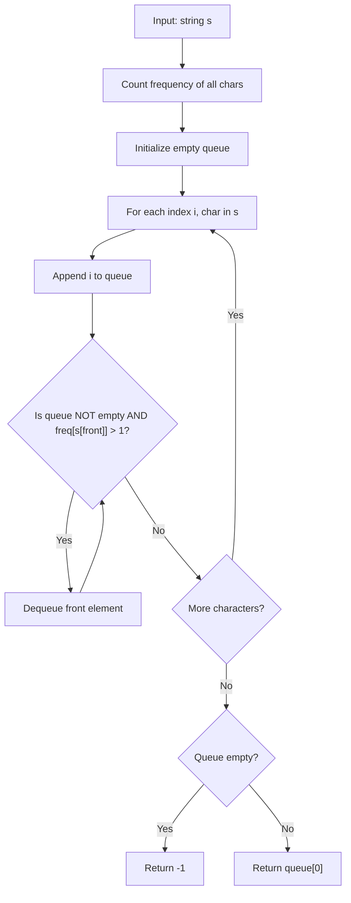

# LC 387 - First Unique Character in a String

## Problem

Given a string `s`, find the **first non-repeating character** in it and return its **index**. If it does not exist, return `-1`.

---

## Examples

### Example 1

```
Input:  s = "leetcode"
Output: 0
```

The first unique character is `'l'` at index 0.

---

### Example 2

```
Input:  s = "loveleetcode"
Output: 2
```

The first unique character is `'v'` at index 2.

---

### Example 3

```
Input:  s = "aabb"
Output: -1
```

Every character repeats. No unique character exists.

---

## Approach: Frequency Map + Queue

### Key Insight

We need the **first** character that appears exactly once. A queue is perfect here because:

1. It preserves the original order of characters
2. We can clean up (remove) non-unique characters from the **front** as we go
3. Whatever remains at the front after processing is guaranteed to be the first unique character

### Algorithm

1. Count the frequency of every character using `Counter`
2. Initialize an empty queue
3. Iterate through the string:
   - Push current index `i` to the back of the queue
   - While the front of the queue points to a character with frequency > 1 → pop it (it can never be unique)
4. After the loop, if the queue is not empty, the front index is the answer; otherwise return -1

```python
from collections import deque, Counter

class Solution:
    def firstUniqChar(self, s: str) -> int:
        freq = Counter(s)
        queue = deque()

        for i, char in enumerate(s):
            queue.append(i)
            while queue and freq[s[queue[0]]] > 1:
                queue.popleft()

        return queue[0] if queue else -1
```

---

## Complexity Analysis

|                         | Time                                                        | Space                                   |
| ----------------------- | ----------------------------------------------------------- | --------------------------------------- |
| **firstUniqChar** | **O(n)** — one pass for counting, one pass for queue | **O(n)** — queue + frequency map |

---

## Flowchart



---

## Example Test Case Trace

**Input:** `s = "loveleetcode"`

### Step 1: Frequency map

```
l: 2, o: 2, v: 1, e: 3, t: 1, c: 1, d: 1
```

### Step 2: Process each character with queue

| Index | Char | Queue after append          | Cleanup (pop front if freq>1) | Queue after cleanup         |
| ----- | ---- | --------------------------- | ----------------------------- | --------------------------- |
| 0     | l    | `[0]`                     | freq['l']=2>1 → pop          | `[]`                      |
| 1     | o    | `[1]`                     | freq['o']=2>1 → pop          | `[]`                      |
| 2     | v    | `[2]`                     | freq['v']=1 → keep           | `[2]`                     |
| 3     | e    | `[2,3]`                   | freq['v']=1 → keep           | `[2,3]`                   |
| 4     | l    | `[2,3,4]`                 | freq['v']=1 → keep           | `[2,3,4]`                 |
| 5     | e    | `[2,3,4,5]`               | freq['v']=1 → keep           | `[2,3,4,5]`               |
| 6     | e    | `[2,3,4,5,6]`             | freq['v']=1 → keep           | `[2,3,4,5,6]`             |
| 7     | t    | `[2,3,4,5,6,7]`           | freq['v']=1 → keep           | `[2,3,4,5,6,7]`           |
| 8     | c    | `[2,3,4,5,6,7,8]`         | freq['v']=1 → keep           | `[2,3,4,5,6,7,8]`         |
| 9     | o    | `[2,3,4,5,6,7,8,9]`       | freq['v']=1 → keep           | `[2,3,4,5,6,7,8,9]`       |
| 10    | d    | `[2,3,4,5,6,7,8,9,10]`    | freq['v']=1 → keep           | `[2,3,4,5,6,7,8,9,10]`    |
| 11    | e    | `[2,3,4,5,6,7,8,9,10,11]` | freq['v']=1 → keep           | `[2,3,4,5,6,7,8,9,10,11]` |

### Step 3: Result

```
Queue front = 2
Return 2
```

---

## Run Tests

```bash
PYTHONPATH=/workspaces/Data-Structure-and-Algorithm- python Queue/LC_387/test.py
```
