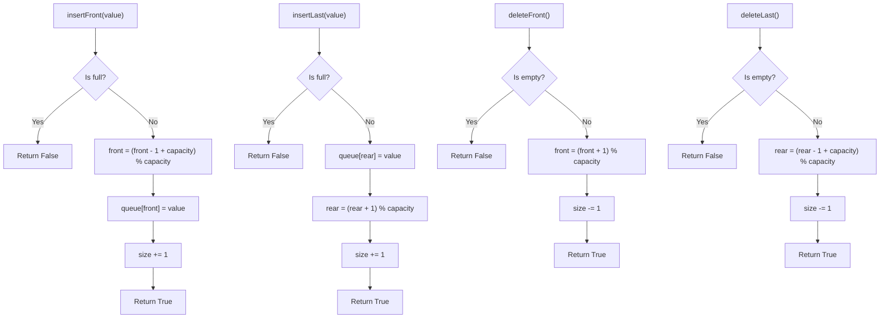

# LC 641 - Design Circular Deque

## Problem

Design your implementation of the circular double-ended queue (deque).

Implement the `MyCircularDeque` class:

- `MyCircularDeque(int k)` Initializes the deque with a maximum size of `k`
- `boolean insertFront()` Adds an item at the front of Deque. Returns `true` if the operation is successful, or `false` otherwise
- `boolean insertLast()` Adds an item at the rear of Deque. Returns `true` if the operation is successful, or `false` otherwise
- `boolean deleteFront()` Deletes an item from the front of Deque. Returns `true` if the operation is successful, or `false` otherwise
- `boolean deleteLast()` Deletes an item from the rear of Deque. Returns `true` if the operation is successful, or `false` otherwise
- `int getFront()` Returns the front item from the Deque. Returns `-1` if the deque is empty
- `int getRear()` Returns the last item from Deque. Returns `-1` if the deque is empty
- `boolean isEmpty()` Returns `true` if the deque is empty, or `false` otherwise
- `boolean isFull()` Returns `true` if the deque is full, or `false` otherwise

---

## Examples

### Example 1

```
Input:
["MyCircularDeque", "insertLast", "insertLast", "insertFront", "insertFront", "getRear", "isFull", "deleteLast", "insertFront", "getFront"]
[[3], [1], [2], [3], [4], [], [], [], [4], []]

Output:
[null, true, true, true, false, 2, true, true, true, 4]
```

**Explanation:**

```
MyCircularDeque myCircularDeque = new MyCircularDeque(3);
myCircularDeque.insertLast(1);  // return True
myCircularDeque.insertLast(2);  // return True
myCircularDeque.insertFront(3); // return True
myCircularDeque.insertFront(4); // return False, the queue is full.
myCircularDeque.getRear();      // return 2
myCircularDeque.isFull();       // return True
myCircularDeque.deleteLast();   // return True
myCircularDeque.insertFront(4); // return True
myCircularDeque.getFront();     // return 4
```

---

## Approach: Array with Pointers

### Key Insight

A circular deque extends the circular queue concept by allowing insertions and deletions from **both ends**. We use the same array + pointer approach as LC 622, but with additional operations for the front end.

The key difference from a regular circular queue:

- `insertFront`: Move `front` **backward**, then insert
- `insertLast`: Insert at `rear`, then move `rear` **forward**
- `deleteFront`: Move `front` **forward**
- `deleteLast`: Move `rear` **backward**

### Visual Representation

```
Capacity = 3, after insertLast(1), insertLast(2)

Index:    0      1      2
Queue:  [ 1  ] [ 2 ]  [ ? ]
          ^front         ^rear

After insertFront(3):
Index:    0      1      2
Queue:  [ 3  ] [ 1 ]  [ 2 ]
          ^front         ^rear
```

### Algorithm

- **insertFront(value):** If not full, move `front` backward `(front - 1 + capacity) % capacity`, then place value
- **insertLast(value):** If not full, place value at `rear`, then advance `rear` `(rear + 1) % capacity`
- **deleteFront():** If not empty, advance `front` forward `(front + 1) % capacity`
- **deleteLast():** If not empty, move `rear` backward `(rear - 1 + capacity) % capacity`
- **getFront():** Return `queue[front]` if not empty, else `-1`
- **getRear():** Return `queue[(rear - 1 + capacity) % capacity]` if not empty, else `-1`
- **isEmpty():** Return `size == 0`
- **isFull():** Return `size == capacity`

```python
class MyCircularDeque:

    def __init__(self, k: int):
        self.queue = [0] * k
        self.front = 0
        self.rear = 0
        self.size = 0
        self.capacity = k

    def insertFront(self, value: int) -> bool:
        if self.isFull():
            return False
        self.front = (self.front - 1 + self.capacity) % self.capacity
        self.queue[self.front] = value
        self.size += 1
        return True

    def insertLast(self, value: int) -> bool:
        if self.isFull():
            return False
        self.queue[self.rear] = value
        self.rear = (self.rear + 1) % self.capacity
        self.size += 1
        return True

    def deleteFront(self) -> bool:
        if self.isEmpty():
            return False
        self.front = (self.front + 1) % self.capacity
        self.size -= 1
        return True

    def deleteLast(self) -> bool:
        if self.isEmpty():
            return False
        self.rear = (self.rear - 1 + self.capacity) % self.capacity
        self.size -= 1
        return True

    def getFront(self) -> int:
        if self.isEmpty():
            return -1
        return self.queue[self.front]

    def getRear(self) -> int:
        if self.isEmpty():
            return -1
        return self.queue[(self.rear - 1 + self.capacity) % self.capacity]

    def isEmpty(self) -> bool:
        return self.size == 0

    def isFull(self) -> bool:
        return self.size == self.capacity
```

---

## Complexity Analysis

| Operation       | Time           | Space |
| --------------- | -------------- | ----- |
| `insertFront` | **O(1)** | O(1)  |
| `insertLast`  | **O(1)** | O(1)  |
| `deleteFront` | **O(1)** | O(1)  |
| `deleteLast`  | **O(1)** | O(1)  |
| `getFront`    | **O(1)** | O(1)  |
| `getRear`     | **O(1)** | O(1)  |
| `isEmpty`     | **O(1)** | O(1)  |
| `isFull`      | **O(1)** | O(1)  |

**Overall space:** O(k) for the underlying array

---

## Flowchart



---

## Example Test Case Trace

**Operations:** `insertLast(1)`, `insertLast(2)`, `insertFront(3)`, `insertFront(4)`, `getRear()`, `isFull()`, `deleteLast()`, `insertFront(4)`, `getFront()`

| Operation      | queue (indices 0,1,2) | front | rear | size | Action                                |
| -------------- | --------------------- | ----- | ---- | ---- | ------------------------------------- |
| Init           | `[0, 0, 0]`         | 0     | 0    | 0    | Empty                                 |
| insertLast(1)  | `[1, 0, 0]`         | 0     | 1    | 1    | queue[0]=1, rear→1                   |
| insertLast(2)  | `[1, 2, 0]`         | 0     | 2    | 2    | queue[1]=2, rear→2                   |
| insertFront(3) | `[3, 2, 0]`         | 2     | 2    | 3    | front=(0-1+3)%3=2, queue[2]=3         |
| insertFront(4) | `[3, 2, 0]`         | 2     | 2    | 3    | **Full, return False**          |
| getRear()      | `[3, 2, 0]`         | 2     | 2    | 3    | queue[(2-1+3)%3]=queue[1]=**2** |
| isFull()       | `[3, 2, 0]`         | 2     | 2    | 3    | size==3,**True**                |
| deleteLast()   | `[3, 2, 0]`         | 2     | 1    | 2    | rear=(2-1+3)%3=1                      |
| insertFront(4) | `[4, 2, 0]`         | 1     | 1    | 3    | front=(2-1+3)%3=1, queue[1]=4         |
| getFront()     | `[4, 2, 0]`         | 1     | 1    | 3    | queue[1]=**4**                  |

---

## Run Tests

```bash
PYTHONPATH=/workspaces/Data-Structure-and-Algorithm- python Queue/LC_641/test.py
```
