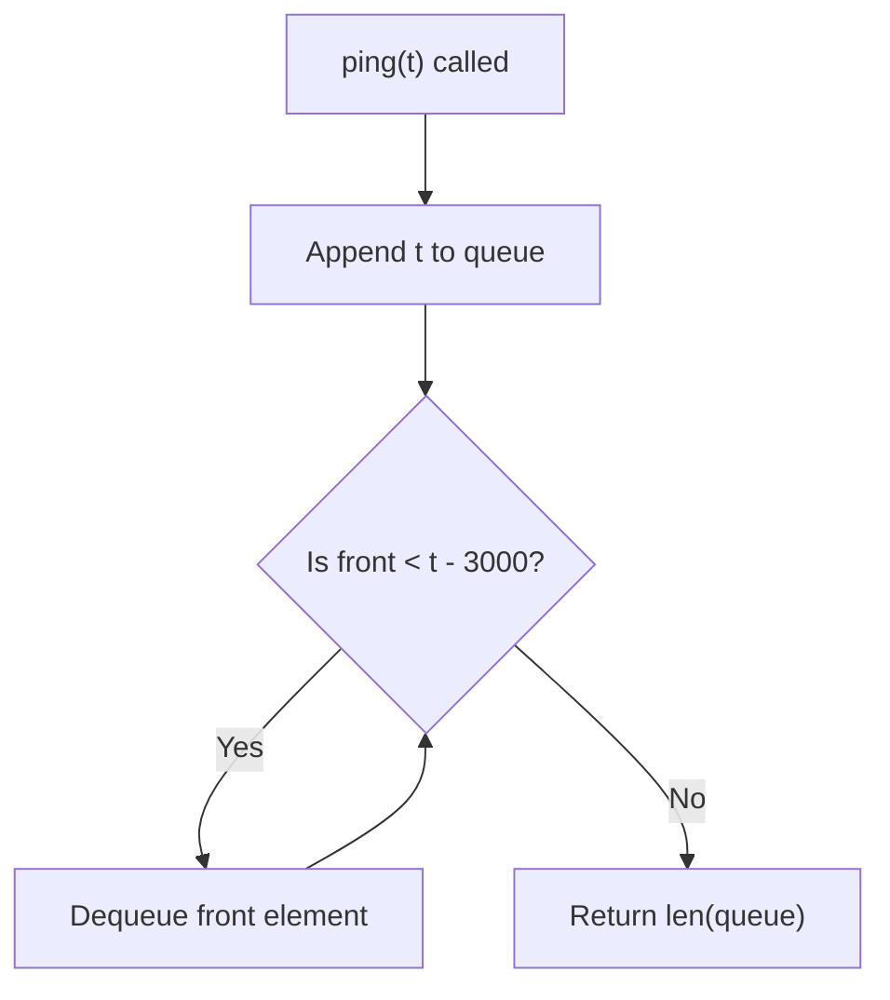

# LC 933 - Number of Recent Calls

## Problem

You have a `RecentCounter` class. It counts the number of **recent calls** that happened in the last **3000 milliseconds**.

The class has one method:

```python
def ping(self, t: int) -> int:
```

- `t` represents the time (in milliseconds) of a new call
- Timestamps `t` are passed in **strictly increasing order**
- `ping(t)` returns the number of calls that happened in the time range `[t - 3000, t]` (inclusive on both ends)

---

## Approach: Sliding Window with Queue

We use a queue to store all active timestamps:

1. When `ping(t)` is called → **enqueue** `t` at the back
2. While the **front** element is outside the window (`< t - 3000`) → **dequeue** it
3. Return `len(queue)` — that's our answer

This works because:

- Timestamps arrive in increasing order
- The oldest (most likely expired) element is always at the **front**
- Expired elements are removed efficiently from the front of the queue

---

## Code

```python
from collections import deque


class RecentCounter:

    def __init__(self):
        self.queue = deque()

    def ping(self, t: int) -> int:
        self.queue.append(t)

        while self.queue and self.queue[0] < t - 3000:
            self.queue.popleft()

        return len(self.queue)
```

---

## Complexity Analysis

|                   | Time                                                                      | Space                                                   |
| ----------------- | ------------------------------------------------------------------------- | ------------------------------------------------------- |
| **ping(t)** | **O(1) amortized** — each element enters and leaves the queue once | **O(W)** — at most W=3000 elements in the window |

---

## Flowchart"



---

## Example Test Case Trace

**Input:** `ping([1, 100, 3001, 3002])`

| Step | Call           | Action                                                  | Queue State           | Return |
| ---- | -------------- | ------------------------------------------------------- | --------------------- | ------ |
| 1    | `ping(1)`    | Append 1. Check front: 1 < 1-3000? No                   | `[1]`               | 1      |
| 2    | `ping(100)`  | Append 100. Check front: 1 < 100-3000? No               | `[1, 100]`          | 2      |
| 3    | `ping(3001)` | Append 3001. Check front: 1 < 3001-3000? No             | `[1, 100, 3001]`    | 3      |
| 4    | `ping(3002)` | Append 3002. Check front: 1 < 3002-3000? Yes → dequeue | `[100, 3001, 3002]` | 3      |

---

## Run Tests

```bash
python Queue/LC_933/test.py
```
