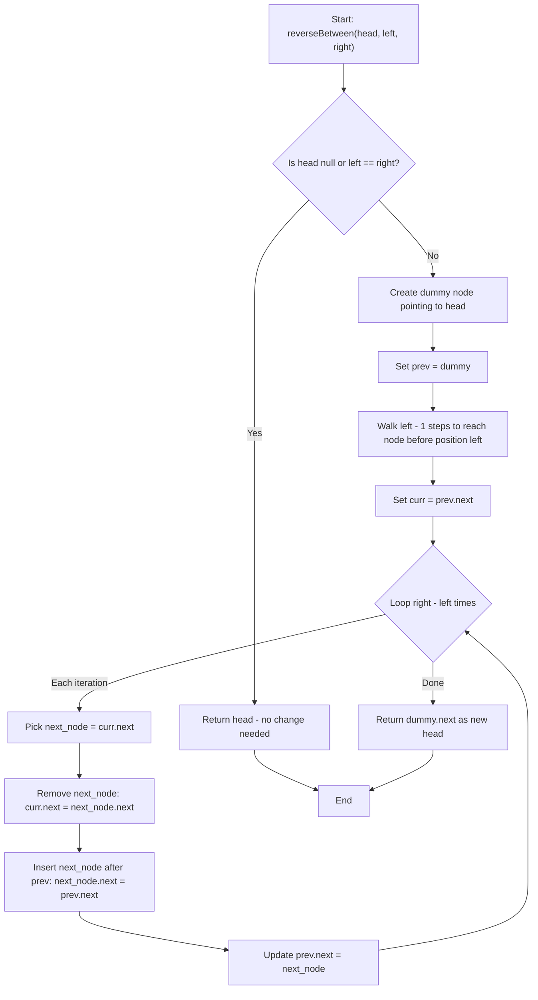

# LeetCode 92 - Reverse Linked List II

## Problem Statement

Given the head of a singly linked list and two integers `left` and `right` where `left <= right`, reverse the nodes of the list from position `left` to position `right`, and return the reversed list.

**Example:**

```
Input:  head = [1,2,3,4,5], left = 2, right = 4
Output: [1,4,3,2,5]
```

**Constraints:**

- The number of nodes is `n`.
- `1 <= n <= 500`
- `-500 <= Node.val <= 500`
- `1 <= left <= right <= n`

## Solution Overview

The algorithm reverses only the sublist between positions `left` and `right` using an **insertion-style** approach:

1. Use a **dummy node** before the head to handle edge cases (e.g., when `left == 1`).
2. Walk to the node just before position `left` — call it `prev`.
3. For each of the next `(right - left)` iterations, take the node after `curr` and move it to right after `prev`.

This effectively "pulls" nodes from the unreversed tail and inserts them at the front of the reversed portion.

## Flowchart



## Complexity

| Aspect | Complexity                                                       |
| ------ | ---------------------------------------------------------------- |
| Time   | O(n) — single pass to reach`left`, then O(right - left) swaps |
| Space  | O(1) — only a few pointer variables                             |

## Files

| File          | Description                                                           |
| ------------- | --------------------------------------------------------------------- |
| `code.py`   | Solution implementation with`ListNode` and `Solution` class       |
| `test.py`   | Test cases covering standard, edge, and boundary scenarios            |
| `README.md` | This file — problem explanation, solution walkthrough, and flowchart |

## How to Run

```bash
python3 test.py
```
