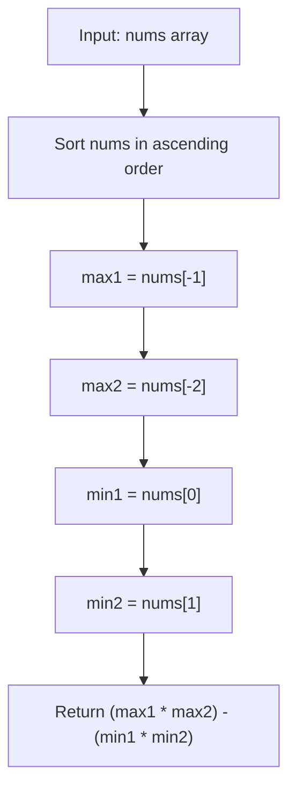

# LC 1913 - Maximum Product Difference Between Two Pairs

## Problem

The **product difference** between two pairs `(a, b)` and `(c, d)` is defined as:

```
(a * b) - (c * d)
```

Given an integer array `nums`, choose four **distinct** indices `w`, `x`, `y`, and `z` such that the product difference is maximized. Return the maximum possible product difference.

---

## Examples

### Example 1

```
Input:  nums = [5, 6, 2, 7, 4]
Output: 34
```

**Explanation:**

- The two largest numbers are `7` and `6`, their product = `42`
- The two smallest numbers are `2` and `4`, their product = `8`
- Product difference = `42 - 8 = 34`

---

### Example 2

```
Input:  nums = [4, 2, 5, 9, 7, 4, 8]
Output: 64
```

**Explanation:**

- The two largest numbers are `9` and `8`, their product = `72`
- The two smallest numbers are `2` and `4`, their product = `8`
- Product difference = `72 - 8 = 64`

---

## Approach: Sort and Pick Extremes

### Key Insight

To maximize `(a * b) - (c * d)`:

- We want the **first product** to be as **large** as possible → multiply the two largest numbers
- We want the **second product** to be as **small** as possible → multiply the two smallest numbers

After sorting the array in ascending order:

- The two largest elements are at indices `-1` and `-2`
- The two smallest elements are at indices `0` and `1`

### Algorithm

1. Sort `nums` in ascending order
2. Return `nums[-1] * nums[-2] - nums[0] * nums[1]`

```python
class Solution:
    def maxProductDifference(self, nums: list[int]) -> int:
        nums.sort()
        return nums[-1] * nums[-2] - nums[0] * nums[1]
```

---

## Complexity Analysis

|                                | Time                                         | Space                                |
| ------------------------------ | -------------------------------------------- | ------------------------------------ |
| **maxProductDifference** | **O(n log n)** — dominated by sorting | **O(1)** extra (in-place sort) |

---

## Flowchart



---

## Example Test Case Trace

**Input:** `nums = [5, 6, 2, 7, 4]`

### Step 1: Sort the array

```
Original: [5, 6, 2, 7, 4]
Sorted:   [2, 4, 5, 6, 7]
```

### Step 2: Identify extremes

| Category     | Indices | Values | Product |
| ------------ | ------- | ------ | ------- |
| Two largest  | -2, -1  | 6, 7   | 42      |
| Two smallest | 0, 1    | 2, 4   | 8       |

### Step 3: Calculate difference

```
Product difference = 42 - 8 = 34
```

---

## Run Tests

```bash
PYTHONPATH=/workspaces/Data-Structure-and-Algorithm- python Sorting/LC_1913/test.py
```
