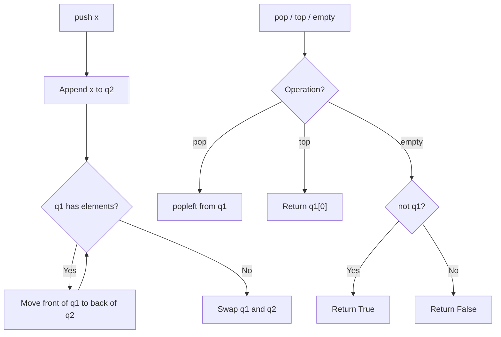

# LC 225 - Implement Stack using Queues

## Problem

Implement a last-in-first-out (LIFO) stack using only two queues. You should implement the stack's standard operations:

- `push(x)` — Push element `x` onto the stack
- `pop()` — Removes the element on top of the stack and returns it
- `top()` — Returns the element on top of the stack
- `empty()` — Returns `true` if the stack is empty, `false` otherwise

**Note:** You must use only standard operations of a queue: push to back, peek/pop from front, size, and is empty operations.

---

## Examples

### Example 1

```
Input:
["MyStack", "push", "push", "top", "pop", "empty"]
[[], [1], [2], [], [], []]

Output:
[null, null, null, 2, 2, false]
```

**Explanation:**

```
MyStack myStack = new MyStack();
myStack.push(1);
myStack.push(2);
myStack.top();      // return 2
myStack.pop();      // return 2
myStack.empty();    // return false
```

---

## Approach: Two Queues (Lazy Reordering)

### Key Insight

A queue is **FIFO** (First In, First Out), but a stack is **LIFO** (Last In, First Out). We need to reverse the order somehow.

The trick: when pushing a new element, we place it in the second queue, then move all existing elements from the first queue into the second queue. Then we swap the queues. This ensures the newest element is always at the **front** of `q1`.

### Visual Example

After `push(1)`:

```
q1 = [1]
q2 = []
```

After `push(2)`:

- Add 2 to q2: `q2 = [2]`
- Move all from q1 to q2: `q2 = [2, 1]`, `q1 = []`
- Swap: `q1 = [2, 1]`, `q2 = []`

After `push(3)`:

- Add 3 to q2: `q2 = [3]`
- Move all from q1 to q2: `q2 = [3, 2, 1]`, `q1 = []`
- Swap: `q1 = [3, 2, 1]`, `q2 = []`

---

## Algorithm

Now `q1` has elements in **reverse order** — exactly like a stack:

- `pop()` returns `3` (the most recently pushed)
- `top()` returns `3`
- `empty()` checks if `q1` is empty

### Algorithm

- `push(x)`: add `x` to `q2`, move all from `q1` to `q2`, swap `q1` and `q2` — O(n)
- `pop()`: `q1.popleft()` — O(1)
- `top()`: `q1[0]` — O(1)
- `empty()`: `not q1` — O(1)

```python
from collections import deque


class MyStack:

    def __init__(self):
        self.q1 = deque()
        self.q2 = deque()

    def push(self, x: int) -> None:
        self.q2.append(x)
        while self.q1:
            self.q2.append(self.q1.popleft())
        self.q1, self.q2 = self.q2, self.q1

    def pop(self) -> int:
        return self.q1.popleft()

    def top(self) -> int:
        return self.q1[0]

    def empty(self) -> bool:
        return not self.q1
```

---

## Complexity Analysis

| Operation   | Time                                         | Space |
| ----------- | -------------------------------------------- | ----- |
| `push(x)` | **O(n)** — move all existing elements | O(1)  |
| `pop()`   | **O(1)**                               | O(1)  |
| `top()`   | **O(1)**                               | O(1)  |
| `empty()` | **O(1)**                               | O(1)  |

**Overall space:** O(n) — both queues together store all n elements

---

## Flowchart



---

## Example Test Case Trace

**Operations:** `push(1)`, `push(2)`, `top()`, `pop()`, `empty()`

| Operation   | q1         | q2     | Action                                                   |
| ----------- | ---------- | ------ | -------------------------------------------------------- |
| `push(1)` | `[1]`    | `[]` | Add to q2, move none, swap                               |
| `push(2)` | `[2, 1]` | `[]` | Add 2 to q2 →`[2]`, move 1 from q1 → `[2,1]`, swap |
| `top()`   | `[2, 1]` | `[]` | Return`q1[0]` = **2**                            |
| `pop()`   | `[1]`    | `[]` | Remove front →**2**                               |
| `empty()` | `[1]`    | `[]` | q1 not empty →**False**                           |

---

## Run Tests

```bash
PYTHONPATH=/workspaces/Data-Structure-and-Algorithm- python Stack/LC_225/test.py
```
